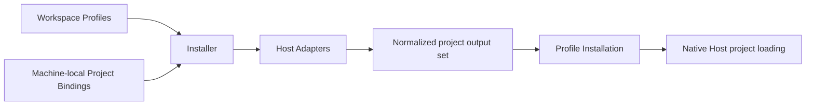

# Agent Profile Kit Architecture

This document describes the implemented project-bound architecture for Profile Context and portable Skills on Antigravity CLI, Codex CLI, Claude Code, Grok, OpenCode, and Pi. Antigravity Context and shared Skill delivery use native project surfaces; the former per-session overlay implementation is removed.

## Purpose

Agent Profile Kit is an open-source, user-agnostic tool and format for defining portable Profiles once and installing them into local projects for supported Agent Hosts. Hosts load the generated material through their native project discovery; Agent Profile Kit does not participate when a Host session runs.

The tool repository owns the CLI, schemas, Installer, Adapters, and product documentation. Each user owns an independent Workspace containing reusable cross-project material. Each project repository remains authoritative for its own facts and configuration.

## Application Boundary

```text
~/.agents/agent-profile-kit/
├── workspace/                 # Fixed-default user-owned Workspace (when selected)
│   ├── workspace.yaml         # Required Workspace Manifest (schema marker)
│   ├── profiles/              # Optional category; missing means empty
│   ├── context/
│   ├── skills/
│   ├── agents/
│   ├── hooks/
│   └── tools/
├── config.yaml                # Machine-local explicit Workspace selection + Project Bindings
└── state/                     # Durable ownership evidence and staging state
```

Each machine has exactly one selected Workspace. The fixed default is `~/.agents/agent-profile-kit/workspace/`, and current Local Configuration explicitly records either that path or one absolute or home-relative custom path. `init <workspace>` may scaffold a missing or empty non-symlink custom destination, or adopt an existing valid Workspace, before recording the authored selection. Symlinks are resolved once at ingestion to a canonical directory while the authored spelling remains available for diagnostics. Profiles and artifacts may be version-controlled independently of the engine. `config.yaml` is machine-local because checkout paths, Workspace placement, and installed Hosts vary by machine. Credential values belong in Host authentication, environment references, or operating-system secret storage and are invalid in both the Workspace and installation records.

```yaml
schema_version: 2
workspace: ~/projects/agent-profile-workspace   # required; absolute or ~/… only
bindings: []
```

A valid Workspace requires only a supported `workspace.yaml`. Artifact directories and bootstrap docs (`README.md`, `AGENTS.md`, `.gitignore`) are initialization scaffolding for discoverability, not permanent format requirements: missing categories ingest as empty, and present artifacts remain fully validated. That layout rule is enforced by CLI **0.16.1+**; it does not change `workspace.yaml` `schema_version` (still `1`). Machines on 0.15.x or older still require the full scaffold — restore the six category directories and bootstrap files before rolling a CLI back, or keep every shared Workspace fully scaffolded in mixed-version environments (see the Workspace guide).

New Workspaces also scaffold a neutral example Profile and Context Module as one bindable pair. They are optional after initialization and must be removed together so the Profile does not select a missing Context Module.

A version-1 Local Configuration without `workspace` is legacy migration input only. `init` records the conventional default when upgrading it; desired-state and binding-recording commands fail closed with `apkit init` guidance until migration completes. Current Local Configuration schema version is `2` and its `workspace` field is required. Older engines are not claimed to understand the version-2 file. Before migrating a legacy file, operators must retain a pre-migration backup; rollback without that backup is unsupported. The immediately previous 0.20.x CLI can use the restored version-1 configuration; follow the [Workspace migration guide](guides/workspace.md#legacy-local-configuration-migration-and-version-compatibility) for the restore procedure.

Desired-state commands (`validate`, `status`, and `apply`) resolve the Workspace through the shared Local Configuration ingestion boundary (`ingestApplication`) before reading artifacts or Project Bindings. `init` separately parses Local Configuration and validates an explicit request against the configured canonical selection before preparing source or publishing configuration. With no argument, a configured custom path is validated without creating or repairing it. `uninstall` intentionally operates from installation ownership state only and does not resolve a Workspace, keeping recovery independent of valid source or configuration. Invalid configured or explicit targets (relative paths, wildcards, files, dangling symlinks, empty symlink targets, and non-Workspace directories) fail before any Workspace or configuration publication.

`apkit init` idempotently creates a fully scaffolded Workspace at the fixed default or at one explicit requested destination and a minimal `config.yaml` containing `schema_version: 2`, the authored `workspace` path, and `bindings: []` when Local Configuration is absent. `installer/authoring-examples.ts` is the canonical home for the neutral Profile, Context Module, and Skill examples consumed by initialization, focused guides, and command examples; initialization writes only the Profile and Context Module. A valid existing explicit destination is adopted without changing source. When configuration already selects a Workspace, zero-argument `init` validates it; an explicit request must resolve to the same canonical directory, while a different selection fails before source or configuration writes. When upgrading a legacy version-1 configuration, `init` validates the effective Workspace and atomically publishes only the migrated Local Configuration, preserving its Project Bindings and authored content. It never overwrites an existing Workspace or current local configuration, and it does not recreate optional scaffolding inside an already valid Workspace (including a Manifest-only tree). Humans and agents edit Workspace artifacts directly. Project Bindings may be hand-edited in Local Configuration or recorded with the authoring-only `bind` command; Local Configuration remains the sole canonical home either way.

## Runtime Boundary

Agent Profile Kit participates only during explicit reconciliation:



There is no Agent Profile Kit launcher, session router, global Skill projection, background watcher, or runtime daemon. A project has at most one bound Profile at a time. All sessions launched in that project receive the same installed Profile, and simultaneous session-specific Profiles in one project are intentionally unsupported.

## Project Bindings

A Project Binding associates exactly one explicit project root with one Profile and a set of Agent Hosts:

```yaml
schema_version: 2
workspace: ~/projects/agent-profile-workspace
bindings:
  - project: ~/projects/tools/agent-profile-kit
    profile: engineering
    hosts:
      - codex
      - claude
      - grok
      - pi
  - project: ~/projects/business/customer-portal
    profile: engineering
    hosts:
      - codex
```

Every `project` is an explicit existing directory that the user declares to be the project root. Paths must be absolute or begin with `~/`; other relative paths are invalid. Home-relative paths and symbolic links are normalized once at ingestion to a canonical absolute directory, which is used for identity and installation state while the authored spelling remains available for display. Wildcards, directory scans, and implicit parent-root detection are unsupported. A canonical project root may appear in exactly one binding; duplicates are invalid regardless of whether their Profile and Hosts agree.

Host selections are a set normalized at Local Configuration and `bind` ingestion: authored order and repeated entries collapse to the deterministic `SUPPORTED_HOSTS` order (`antigravity`, `claude`, `codex`, `grok`, `opencode`, `pi`).

Git is optional. When a project is not a Git working tree, native Codex discovery can guarantee the installed project Context only when Codex starts in the exact bound root; starting it in a descendant is unsupported because Codex has no repository boundary to search toward. Claude project rules and Grok project rules load from the project root independently of Git. The project workflow documents the Codex launch-from-root constraint.

For a Git binding, the Installer reconciles only the explicit canonical project root. It uses Git only to inspect that root's repository boundary, tracked paths, and repository-local exclusions; it does not enumerate, classify, deduplicate, or report worktree topology. A primary checkout and linked worktree are indistinguishable at the Project Binding boundary. A Host session launched from the bound root may operate on files elsewhere, while any other root that must support direct Host launches requires its own explicit Project Binding.

Every bound root, Git or non-Git, uses the same removal semantics. The ordinary order is `unbind`, `apply`, then delete the directory. If the directory is deleted first, the binding remains desired state until `unbind` matches its exact authored path. That explicit removal confirms intent; the next `apply` retires the absent Profile Installation without project filesystem deletion and removes any separately surviving repository-local exclusion entries whose ownership was recorded for that installation. Restoring the project later requires a new `bind` and `apply`. Worktrees receive no special deletion or recovery mechanism.

The former development-only automatic worktree expansion has no compatibility or state-migration path. It was never released; development installations created by that behavior are reset and reapplied from canonical source.

Commands separate binding authoring from global reconciliation:

- `bind` records Project Bindings in Local Configuration only: it appends one validated binding, or with `--replace` restates the single existing binding for the same canonical project root — its Profile and Host set become the exact desired final set, reported as an old → new receipt. It serializes other `bind` processes with a sidecar lock, rechecks the exact source snapshot, and publishes with an atomic replacement. It does not plan or apply output and does not touch Host, Workspace, project, or installation state.
- `unbind` removes one Project Binding from Local Configuration only. Existing paths match by canonical identity; a missing path may match only its exact authored spelling. It uses the same lock, snapshot recheck, and atomic publication boundary as `bind`, and never removes generated output.
- `validate` checks the Workspace and Project Bindings without writing state. A successful human result derives its next action from the normalized Project Binding count: zero points to `bind`, while one or more points to `status`; warnings remain visible without changing that branch.
- `info [--json]` reports the engine version and the selected Workspace, Local Configuration, and Installation State locations without enumerating Workspace artifacts, Host state, Project Bindings, or Installation State contents, and never changes state. Its versioned machine payload identifies `current`, `legacy`, or `not-configured` Local Configuration; legacy input is reported as migration-required rather than as an unconfigured Workspace.
- `list` prints the available read-only inventory topics and descriptions from one canonical topic table. Focused human inventory presents instructional usage rather than an optional or redundant `Next:` action; JSON remains unchanged.
  - `list projects` reads the normalized Local Configuration model and renders every Project Binding's short Project identity, Profile, and normalized Host set; a per-binding path problem is retained instead of aborting the inventory. It does not inspect Workspace artifacts.
  - `list profiles` reads the normalized selected Workspace model and renders every valid Profile ID with selected Context Module and Skill counts in deterministic order. It does not inspect Project roots and fails through Workspace ingestion when its selected source is missing or invalid.
  - `list hosts` reads normalized Host inventory records from capability constants and renders the canonical Hosts supported for configured Projects in its concise human view, with guidance to select a listed Host through `bind`, without inspecting PATH, Host versions, configuration, or Project surfaces.
  - `list temporary` reads active Temporary Profile Installation records from Installation State, omits terminal removed identities and ordinary installations, and renders each temporary identity with its short Project path, Profile, and Host. It does not inspect Local Configuration, Workspace artifacts, Git, project output, or Host capabilities.
  - Each topic's `--json` view emits its normalized inventory records with engine provenance; Host JSON retains Temporary Profile Installation eligibility, while temporary JSON retains the canonical Project path and durable temporary installation identity. No inventory topic writes state.
- `apply` reconciles its selected Project scope and, after its commits, performs
  a fresh reconciliation to report the verified resulting state. `apply --all`
  stops every write for a global Blocker, but skips Project-scoped blocked
  Projects while committing healthy Projects sequentially. It separately emits
  an `Applied` section containing only generated-output and Repository Exclusion
  work that committed, distinct from blocked, failed, still-pending, and freshly
  current Project results. Partial blockers exit `2`; a tool or post-commit
  verification failure exits `1` and retains committed-work evidence. `--json`
  includes both the resulting-state snapshot and an `applied` receipt snapshot.
- `status` is the complete apply-equivalent read-only plan. It reports current, not installed, stale source, repairable missing output, drifted output, missing output, malformed ownership, and blocked installations; planned generated-file and Git exclusion operations; predictable Host capability evidence; and warnings. Host Setup Steps remain in the ReconciliationReport and appear in `--verbose` and JSON, but concise `status` renders none. A capability problem that prevents pending application is a Project Blocker. Missing or downgraded Host capability relevant only to current output is Host attention and does not change generated-output ownership state. A bound Project with no ordinary Installation Receipt is not installed and eligible for `apply`; no separate teardown intent is inferred or consulted. A fully current concise status states that fact once with no setup reminder, Project list, or next action; non-current state definitions are available through `--verbose`. `--json` uses the same machine payload and exit-code matrix as `apply`.
- `uninstall` safely removes all owned Profile Installations without deleting the Workspace or bindings, and reports each affected project, removed path, and cleaned Git exclusion entry. (`uninstall` is outside the lifecycle machine surface and keeps its own exit semantics.) Temporary Profile Installations and their Repository Exclusion contributions are preserved.
- `install-temp <profile> <project> --host <host>` installs one Profile temporarily into one explicit Project for one Host marked Temporary-eligible by the canonical Host catalog (`supportsTemporaryProfileInstallation`). It reuses Adapter planning, ownership preflight, transactional publication, and per-receipt Repository Exclusion contributions, writes a durable temporary schema-6 receipt before owned project mutations can be orphaned, and never creates a Project Binding or runs global reconciliation. Concise human success prints the exact `apkit remove-temp <actual-id>` command from that durable identity; `--json` continues to emit the shape-unchanged versioned temporary-installation receipt (now at `schemaVersion: 8`, ADR-0023). Failures after the first visible owned mutation report `removalRequired` with the recoverable `temporaryInstallationId`; predictable validation and ownership blockers still occur before writes and require no removal. Temporary and ordinary Installer publication share an exclusive Installation State lifecycle lock so concurrent operations cannot interleave conflicting ownership writes.
- `remove-temp <temporary-installation-id>` removes only that Temporary Profile Installation's owned outputs and exclusion contribution. Temporary-owned roots are intentionally disposable: removal discards content drift and unexpected members inside complete recorded directories without traversing adjacent unowned paths. Cleanup commits before the terminal state write so an interrupted remove remains retryable. A successful removal leaves a terminal removed identity so repeated calls remain idempotent. Linked worktrees are distinct Projects that may hold independent Temporary Profile Installations while sharing contributor-aware Repository Exclusion ownership.

`status` and `apply` share one machine-surface exit matrix and one JSON serializer
in `cli/presentation.ts`: exit `0` means no tool error and no
blockers (JSON `outcome` may still be `attention` for pending work), exit `1`
is a tool error (`outcome: "error"` under `--json` when flags were accepted),
and exit `2` means blockers are present. The lifecycle JSON contract is versioned
(`schemaVersion: 12`) and publishes global Blockers plus one deterministic record
per Project. Each Project record owns desired identity, state, observable output
operations with consuming Hosts, Project Blockers, structured warnings classified
as `diagnostic` or `host-attention` with their copyable values, Host Setup Steps,
and repository-exclusion work. Every Blocker
serializes its exhaustive structured evidence (`kind`, `scope`, Project identity
when scoped, derived `message`, `problem`, `requirement`, `remedy`, and
`affectedItems`) without parsing rendered prose. Apply publishes the pre-apply
work as a nested `applied` snapshot distinct from the freshly verified resulting
Project records. Execution-error payloads retain that applied snapshot and add
`failedProject` plus `pendingProjects` when a Project transaction fails. The contract carries no separate lifecycle-impact collection
and is not stability-guaranteed before 1.0. Blocked temporary-installation
JSON advances to the same versioned structured blocker records. Temporary
installation receipts use the same exit matrix (`0` / `1` / `2`) with their own
versioned JSON schema and carry no blocker records.

Human lifecycle presentation in `cli/presentation.ts` has three explicit
boundaries over the same ReconciliationReport. Concise output presents the
outcome, affected scope or impact, one next action when one exists, and optional
first-use guidance, in that order. It renders each semantic fact once and omits
routine generated paths, Project matrices, Git exclusion bookkeeping, setup
provenance, and separate consequences. For unblocked pending `status`, one line
carries every non-zero file-operation count when those operations share a
Project scope; differing scopes use compact operation lines without a duplicate
aggregate. Its single `Next:` apply command and optional `Details:` verbose route
preserve the selected invocation scope. Blockers, warnings, ownership attention,
drift, destructive-removal attention, and Git repair or failure retain the
identity required for their remedies. A concise clean `status` states that the
selected scope is current once and emits no Host setup reminder or next action;
a pending concise `status` does not pre-announce post-apply setup.

A changed `apply` leads from its Apply Receipt and cannot describe the selected
Projects as already current when that receipt records work. It renders first-use
Host setup as one action-grouped note with plain reasons when generated outputs
are added or transitioned, omitting standing trust and root-launch reminders on
routine updates and keeping shared-path notes behind `--verbose`. The fresh
post-commit reconciliation remains authoritative for resulting state, while
"already current" is reserved for a true no-op receipt. Changed apply ends with
one invocation-wide statement that the selected Profile or Profiles will load on
the next configured-Host launch from a bound Project root, without splitting
equivalent outcomes by exact Host or Project sets. `--verbose` retains complete
per-Project, generated-path, Git, warning, Blocker, desired-setup, and Host Setup
Step evidence. Versioned JSON retains the complete structured machine evidence,
schemas, and exit semantics; human filtering does not alter it.

`unbind` changes desired Project Binding state and, when an Installation
Manifest shows that generated output still requires reconciliation, states that
generated files remain and directs the user to `status --all`, which presents the
eventual `apply --all`. Successful `bind` and `unbind` receipts are compact
task language: they name the short Project identity with the Profile and Hosts,
omit the Local Configuration location and redundant canonical-path repetition
in routine success, and retain recovery detail only for authored-path matches
where canonical identity or configuration location is actionable. `uninstall` is the separate output-cleanup
lifecycle: it removes only ownership-proven generated output and preserves
bindings. `status` and `apply` select the bound Project containing the current
working directory by default, accept one explicit existing absolute or
home-relative Project root, and use `--all` as their only fleet scope. `bind` and `unbind` are recording-only; hand-editing Local Configuration remains valid,
and `bind` never removes an existing binding — `--replace` opt-in restates one
binding's Profile and Host set in place (see ADR-0010), while removal stays
exclusive to `unbind`.

## Canonical Model

Profiles are explicit flat selections containing exactly `id`, `context`, and `skills`. The current slice accepts Profile Context for Antigravity CLI, Codex, Claude, Grok, OpenCode, and Pi, and portable Skills for Antigravity, Codex, Claude, Grok, OpenCode, and Pi. Antigravity, Codex, OpenCode, and Pi consume the qualified shared `.agents/skills/<Artifact ID>/` projection. Obsolete `agents`, `hooks`, and `tools` Profile placeholders fail at ingestion with removal guidance; those artifact categories remain undelivered. Trusted disabled model-invocation policy is projected into the qualified Host-native Skill package while explicit Artifact ID activation remains available. A Profile must select at least one supported artifact overall; no single category is mandatory, so Context-only, Skills-only, and combined Profiles are valid. A Skills-only Profile installs only selected Skill packages and Installer lifecycle metadata—Adapters emit no Context envelope, Codex SessionStart hooks, Claude unscoped Context rule, or Grok unscoped Context rule, and Host capability preflight is derived from the selected categories. Skills-only remains under Workspace `schema_version: 1` but is a **CLI 0.17.0+** acceptance change: older binaries still reject empty Context selections at ingestion, so convert or uninstall Skills-only Profiles with a 0.17+ CLI before rolling a machine back (see the Workspace guide). Profiles contain no inheritance, wildcards, Host settings, project paths, or artifact versions. A binding always selects the current Workspace form of its Profile; Project-scoped `apply` updates the selected binding and `apply --all` updates every Project bound to that Profile. A Project that needs different material binds to a different Profile rather than pinning an older revision.

Context Modules contain reusable declarative facts, preferences, and standing rules. The engine deterministically composes selected Context inside one canonical complete envelope: a compact metadata header naming the Profile and stating that repository-owned project instructions take precedence on conflict, followed by the normalized Context Module bodies in selection order with no generated per-module markers. Adapters deliver the same semantic envelope without attempting to normalize physical load order across Hosts. Agent Profile Kit does not detect contradictions in prose.

Skills conform to the portable subset of the Agent Skills standard. Standard Skill package members are projected with source bytes and modes preserved, except for Host-native translation of optional model-invocation policy (`metadata.agent-profile-kit.model-invocation`, default `allowed`). Agents, Hooks, and Tools retain their portable canonical definitions and are accepted for a Host only when its Adapter can preserve their required semantics.

Dependencies are explicit typed references. The Installer resolves them transitively, installs each Artifact ID once, and records every inclusion reason.

Each supported Agent Host owns Skill discovery, precedence, deduplication,
collision diagnostics, and resolution across project, personal, package,
plugin, extension, and compatibility sources. Adapters do not reconstruct those
resolvers or inventories. Same-identity material outside an exact planned
output destination is Host Resolution and does not block lifecycle commands.
Where an Adapter can detect a concrete disable without reconstructing Host
Resolution, it emits an actionable warning: Codex checks SessionStart hooks and
Grok checks `[skills].disabled` and `[skills].ignore`. Malformed or unreadable
configuration that an Adapter reads for planned output also warns.
Capability failures, unrepresentable portable semantics, and exact Output
Ownership Conflicts remain blockers.

## Adapter Boundary

Each supported Agent Host has one Adapter that owns its native paths, formats, discovery behavior, version detection, Capability Contract, and Host Setup Steps. An Adapter is a pure planner: it returns exact proposed files, bytes, modes, semantic requirements, and typed post-apply setup requirements but does not write to the filesystem.

One canonical Host registry owns supported Host order and lookup, Adapter versions, Temporary Profile Installation eligibility, and discovery metadata. Its policy-free Host catalog can be consumed by schemas and command validation without loading Adapter implementations; the registry attaches every complete Adapter at the planning boundary and supplies Host inventory. Antigravity, Claude, Codex, Grok, OpenCode, and Pi ordinary planning enter through the complete Adapter contract, which owns capability probing, Project-surface inspection, configuration warnings, topology inputs, output planning, Capability Contract selection, and Host Setup Steps. The Installer only iterates selected registrations, translates Adapter evidence, and normalizes physical outputs; it contains no Host-specific planning fallback. Ordinary and Temporary Profile Installations route capability checks, Project-surface checks, warnings, Capability Contracts, Host Setup Steps, and outputs through the same registered Adapter planning boundary; temporary Host eligibility is registry metadata. Generic executable invocation, core semantic-version handling, filesystem entry classification, and invocation-scoped reuse remain policy-free shared services.

Host Setup Steps use the shared kinds `approval-required`, `trust-required`, `launch-constraint`, and `shared-path`. Every step carries typed provenance classified once at the Adapter boundary (DEC-036): `transition` steps are caused by the current lifecycle transition and name the exact generated output whose addition, update, or repair makes them newly relevant (the Codex hook approval names `.codex/hooks.json`); `standing` steps are persistent constraints (project trust, exact-root launch, shared-path explanation). Host identity has one Adapter-plan-level home; the Installer attaches that identity when it carries each Adapter-authored step into the ReconciliationReport. A step may identify its path semantically as the bound project, leaving the one canonical path presenter to choose its user-facing spelling.

Presentation may order, filter, group, and simplify these records but cannot derive Host knowledge or setup completion. Concise `status` renders no Host Setup Steps. Concise `apply` renders standing trust or root-launch guidance only when its Apply Receipt creates the first relevant output for that Project/Host pairing, and renders transition-triggered approval only when the associated output is added, updated, or repaired. It groups guidance by user action and Host without exposing provenance headings or separate consequence lines. Shared-path explanations and complete provenance, consequences, and Project scopes remain verbose and JSON evidence. Blocked `apply` suppresses guidance for work that did not happen; a no-op `apply` shows no setup and does not claim next-launch Activation. Agent Profile Kit does not claim that Host-owned trust or approval is complete.

The Installer normalizes all Adapter plans for one project into a single output set:

- Identical path, type, mode, and bytes are coalesced and record every consuming Host.
- Any disagreement for the same path fails during `status`.
- Paths that escape the project root are invalid.
- Tracked paths and occupied unowned paths are conflicts.
- The Installer owns complete generated files and artifact directories, never selected fields inside another owner's file.

This makes shared Host paths emerge from exact output equality rather than a maintained compatibility table or Adapter-to-Adapter coordination.

An Adapter rejects a Profile when the detected Host version or project surface cannot preserve every selected artifact. Nothing is silently omitted or weakened. Host authentication, project trust, and approval flows remain native concerns; Agent Profile Kit never writes global trust or authentication state.

## Initial Adapter Mappings

The project-bound release supports Antigravity CLI, Codex CLI, Claude Code, Grok, OpenCode, and Pi on macOS for Profile Context. Antigravity, Codex, Claude, Grok, OpenCode, and Pi support portable Skills, with Antigravity, Codex, OpenCode, and Pi using the qualified shared projection and preserving disabled model invocation; Host-specific delivery remains Adapter-local. Agents, portable Hooks, Tools, and additional Agent Hosts remain explicit future slices. Every complete-envelope Context Adapter emits the same canonical Context envelope (compact Profile identity metadata and repository-instructions precedence followed by normalized module bodies); Antigravity additionally preserves per-module boundary markers in separate always-on rules; Host-specific delivery is Adapter-local.

### Codex

The Codex Adapter generates the composed Context snapshot under an owned `.agent-profile-kit/codex/` path and an owned project `.codex/hooks.json`. A native `SessionStart` Hook prints the snapshot for `startup`, `clear`, and `compact`, which Codex adds as extra developer Context. Resume is intentionally omitted: Codex reconstructs the conversation from the rollout, which already contains any prior injection, so re-running the Hook on resume would duplicate Context. Profile Context is therefore stable for the life of a conversation; a changed Installation takes effect on the next `startup`, `clear`, or `compact`, not merely because the session is reopened. The generated command handler sets `additionalContextLimit: 0`, the Codex contract for passing complete `additionalContext` directly to the model instead of spilling a head-and-tail preview (`0` means unlimited direct delivery, not "none"; see <https://github.com/openai/codex/releases/tag/rust-v0.145.0>). Context capability preflight requires Codex CLI `0.145.0+` (the first stable release containing that handler field) on `PATH` and rejects older, missing, or unreadable versions before writes. Skills-only Codex plans do not probe this floor. `status` proves the same predictable capability evidence as `apply`; a post-apply Codex downgrade below `0.145.0` is Host attention while the generated output remains current, and becomes a Project Blocker when application work is pending. `validate` and `uninstall` remain probe-free. In Git projects the command resolves the snapshot from the Git worktree root plus the binding-relative path; in non-Git projects it uses a project-relative path under the launch-from-root contract. The command embeds no absolute project path and needs no generated helper script. Repository `AGENTS.md` files and global instructions remain live and untouched. When Context is selected, the Adapter emits a transition-triggered hook-approval step tied to the generated `.codex/hooks.json` output and a standing project-trust step; it also emits the standing exact-root launch constraint for a non-Git binding. A Skills-only Codex plan emits none of those Context-specific steps and records a Skills-only Capability Contract. Lifecycle Hooks are enabled by default; the Adapter warns when the effective global or project Codex configuration explicitly disables them (`[features].hooks = false`, with project configuration taking precedence, or the deprecated `codex_hooks` alias), or when relevant configuration is malformed or unreadable. These diagnostics do not block installation. The global file is `CODEX_HOME/config.toml` when `CODEX_HOME` is set, otherwise `~/.codex/config.toml`. Context remains unsupported when the required whole-file path is occupied.

Resolved standard Skill packages are planned as owned artifact directories under the project-relative `.agents/skills/<Artifact ID>/` tree that Codex discovers natively. The qualified shared projector composes each package once: portable members keep source bytes and modes, Agent Profile Kit-only sidecars such as `agent-profile-kit.yaml` are omitted, and unrelated Codex interface/dependency metadata is preserved. Trusted `metadata.agent-profile-kit.model-invocation` (`allowed` default, or `disabled`) is the only policy authority. Allowed Skills add no restriction; disabled Skills receive both top-level `disable-model-invocation: true` in generated `SKILL.md` and Codex `agents/openai.yaml` with `policy.allow_implicit_invocation: false`, without rewriting Workspace source. Generated policy fields carry deterministic explanatory comments. Malformed, wrong-type, or contradictory Codex policy is a project-scoped structured Blocker before reconciliation writes. When any selected Skill is disabled, Codex capability preflight also requires CLI `0.99.0+` (first stable tag with `policy.allow_implicit_invocation`; openai/codex#11244). Context-bearing installations record `native-project-sessionstart-complete-context-v1` or `native-project-sessionstart-complete-context-skills-invocation-v1`; Skills-only installations record `native-project-skills-v1` or `native-project-skills-invocation-v1`. Unselected Workspace Skills are not installed. There is no global Skill library, process filter, or launcher. Codex resolves same-identity Skills from other Host-native sources.

### Claude Code

The Claude Adapter generates the same canonical Context envelope as an unscoped owned project rule at `.claude/rules/agent-profile-kit.md`. The rule has no `paths` frontmatter so Claude loads it project-wide and re-injects it after compaction alongside existing project, local, user, and managed instructions. Resolved standard Skill packages are planned as owned artifact directories under the project-relative `.claude/skills/<Artifact ID>/` tree that Claude discovers natively. Portable package members keep source file bytes and modes; Agent Profile Kit-only sidecars such as `agent-profile-kit.yaml` are omitted. When trusted model-invocation policy is `disabled`, the Claude Adapter projects `disable-model-invocation: true` into generated `SKILL.md`, records Capability Contract `native-project-unscoped-rules-skills-invocation-v1`, and reuses the existing `2.0.64+` CLI floor (which honors that field). Workspace source stays unchanged. Unselected Workspace Skills are not installed. Claude resolves same-identity Skills from personal and other Host-native sources. `CLAUDE.md`, other rules, settings, trust, authentication, plugins, and sessions remain Host-owned and are never modified. Capability preflight requires a Claude Code CLI on `PATH` at or above the Adapter minimum that first shipped recursive `.claude/rules/` support (`2.0.64`, which already includes native project Skill discovery) and rejects non-directory `.claude` or `.claude/rules` surfaces before writes. After a successful check the Installation Receipt records the Claude Capability Contract covering unscoped rules and native Skill discovery, not raw CLI marketing numbers. When both Codex and Claude are bound, each Adapter plans its own Host-native Skill tree; exact shared output coalesces only when path, type, mode, and bytes agree.

Claude plans no Host Setup Steps.

### Grok

The Grok Adapter generates the same canonical Context envelope as an unscoped owned Markdown rule. Grok always scans project `.grok/rules/*.md`; the Adapter’s default owned path is `.grok/rules/agent-profile-kit.md`. When Claude is co-selected on the same Project Binding and Grok reports Claude rules compatibility enabled (`grok inspect --json` `externalCompat` cell `claude`/`rules`), the Grok Adapter plans the exact Claude rule path and envelope bytes so Installer normalization coalesces one effective copy that both Hosts load. That exact coalescing case emits a standing `shared-path` Host Setup Step naming Claude's rule path; Grok-only, compatibility-disabled, and Context-free plans emit no such step. Grok-only bindings and combined bindings with Claude rules disabled continue to use `.grok/rules/`. Resolved standard Skill packages are planned as owned artifact directories under the project-relative `.grok/skills/<Artifact ID>/` tree that Grok discovers natively. Portable package members keep source file bytes and modes; Agent Profile Kit-only sidecars such as `agent-profile-kit.yaml` are omitted. When trusted model-invocation policy is `disabled`, the Grok Adapter projects `disable-model-invocation: true` into generated `SKILL.md`, records Capability Contract `native-project-unscoped-rules-skills-invocation-v1`, and reuses the existing `0.2.0+` CLI floor (which honors that field). Workspace source stays unchanged. Unselected Workspace Skills are not installed. Capability preflight requires a Grok CLI on `PATH` at or above `0.2.0` and rejects non-directory `.grok`, `.grok/rules` (when Context is selected), or `.grok/skills` (when Skills are selected) surfaces before writes. Context planning additionally requires successful `grok inspect --json` so Claude-rule compatibility can be determined; Skills-only planning does not inspect Grok's effective inventory. Grok resolves same-identity material across personal, plugin, compatibility, extra-path, and project sources. A concrete `[skills].disabled` or `[skills].ignore` setting that covers planned output warns without blocking, as does malformed or unreadable relevant configuration. Repository-owned instructions (`AGENTS.md` and peers), other rules, trust, authentication, and Host configuration remain untouched. After a successful check the Installation Receipt records Capability Contract `native-project-unscoped-rules-v1` for Context-only Profiles, `native-project-unscoped-rules-skills-v1` when Skills are selected, or the invocation contract when any selected Skill requires disabled model invocation.

### Pi

The Pi Adapter requires Pi CLI `0.82.1+` and plans the canonical Context
envelope as the complete owned project file `.pi/APPEND_SYSTEM.md`. It plans
each resolved Skill once through the qualified shared `.agents/skills/<Artifact ID>/`
projection, preserving standard package bytes and modes while omitting the
`agent-profile-kit.yaml` sidecar. Codex and Pi use the same complete package
shape and the normalized output records every consuming Host; no consumer list
is added to portable Skill metadata. Allowed-invocation Skills retain their
source `SKILL.md`; disabled-invocation Skills receive the shared top-level
`disable-model-invocation: true` restriction and Codex policy field. Pi honors
the top-level field by hiding the Skill from the model's system prompt while
preserving the canonical `name` used by explicit `/skill:<Artifact ID>` activation.
Pi's official Skills documentation defines this enforcement behavior, introduced
in Pi 0.50.0 and included in the supported 0.82.1+ floor:
<https://pi.dev/docs/latest/skills> and <https://pi.dev/news/releases/0.50.0>.
Before writes it proves `.pi` and the append-system destination only when
Context is selected, and `.agents` plus `.agents/skills` only when Skills are
selected. Pi owns discovery and resolution across personal, ancestor, project,
package, extension, and other configured Skill sources; the Adapter does not
scan or approximate that inventory. For Skill-bearing Profiles, it reads the
canonical global and project Pi settings only to warn when relevant
configuration is malformed or unreadable. Extensions, packages, and additional
Skill sources coexist through Pi Host Resolution and do not block installation.
Context-only Profiles skip this settings inspection. Pi's native project trust,
authentication, settings, prompt files, and per-session overrides remain
Host-owned and are never changed; explicit runtime `--skill` and `--no-skills`
overrides remain outside the Installation guarantee. Every non-empty Pi plan
therefore emits a standing `trust-required` Host Setup Step; it emits no
standing shared-path notice. Context-only installations record
`native-project-append-system-v1`; shared Skills-only and combined installations
record `native-project-shared-skills-v1` and
`native-project-append-system-shared-skills-v1`; installations with at least one
disabled-invocation Skill record `native-project-shared-skills-invocation-v1` or
`native-project-append-system-shared-skills-invocation-v1`, all under Adapter
version `pi-project-v2`.

Installation State with Pi Skill-capable `host_versions` requires Agent Profile
Kit 0.32.0+; unbind Pi or re-apply/uninstall with 0.32.0+ before rolling back
below 0.32.0. Context-only Pi state remains readable with 0.31.0+, and any
Installation State that records the `pi` Host requires 0.31.0+ before rolling
back to 0.30.3 or older. Invocation-capable Pi `host_versions` are first
recorded by Agent Profile Kit 0.34.0; unbind Pi or re-apply/uninstall with
0.34.0+ before rolling back an invocation-capable installation below 0.34.0.

### Antigravity

The Antigravity Adapter requires `agy` CLI `1.1.13+` and plans Profile Context as
owned always-on rules under `.agents/rules/`. Unlike complete-envelope Hosts,
Antigravity's envelope rule preserves only the compact Profile identity and
repository-instruction precedence metadata, while each later rule preserves one
complete Context Module with its generated boundary markers. Rule names use the
stable `agent-profile-kit-000-envelope.md`, followed by ten-spaced module names
in resolved Context order. Every rule includes `trigger: always_on` frontmatter
and stays within Antigravity's 12,000-character limit. An oversized module is a
structured capability Blocker; content is never truncated or omitted.

For Skills, Antigravity consumes the qualified shared `.agents/skills/<Artifact
ID>/` projection used by Codex and Pi. The complete package is composed once,
including the top-level `disable-model-invocation: true` field and
`agents/openai.yaml` `policy.allow_implicit_invocation: false` when the
canonical Workspace policy is disabled. Allowed Skills add no restriction;
explicit Skill activation remains available for disabled Skills. Portable
members, bytes, modes, and unrelated package metadata are preserved, and the
Agent Profile Kit sidecar is omitted. Native Antigravity discovery and
resolution remain Host-owned; the Adapter does not inspect global, ancestor,
package, plugin, extension, or other effective inventories.

Capability preflight checks `agy --version` and only the `.agents`,
`.agents/rules`, and `.agents/skills` surfaces required by the selected
artifact categories. Missing or real directory surfaces are safe; files,
symlinks, and other entries block before writes. Antigravity trust, settings,
native Project records, authentication, plugins, repository-owned
`AGENTS.md`/`GEMINI.md`, and Host Resolution remain Host-owned. Every non-empty
plan emits a standing `trust-required` Host Setup Step without reading or
changing trust state. Context-only, shared Skills-only, combined, and
invocation-capable plans record distinct Adapter Capability Contracts:
`native-project-always-on-rules-v1`, `native-project-shared-skills-v1`,
`native-project-always-on-rules-shared-skills-v1`,
`native-project-shared-skills-invocation-v1`, or
`native-project-always-on-rules-shared-skills-invocation-v1`. The Adapter uses
ordinary exact-root Project Binding behavior and the shared
status/apply/repair/deselection/uninstall and Repository Exclusion
lifecycle.

Installation State that records the new Antigravity Skill contracts requires
Agent Profile Kit 0.83.0+; unbind or uninstall Antigravity with 0.83.0+ before
rolling back below 0.83.0. A rollback without uninstall leaves generated
always-on rules or shared Skills visible to Antigravity even though the older
CLI cannot prove the newer Capability Contract.

### OpenCode

The OpenCode Adapter delivers Profile Context and portable Skills through dedicated Host configuration and the qualified shared `.agents/skills/<Artifact ID>/` projection. It requires an `opencode` executable at or above verified floor `1.18.23` on `PATH` and rejects missing, unreadable, or older binaries with a typed capability failure. Capability preflight verifies that `.agents` and `.agents/skills` are missing or real directories when Skills are selected, that `.opencode` is a directory when configuration is planned (Context or disabled Skills), and that `.agent-profile-kit` and `.agent-profile-kit/opencode` are directories when Context is selected.

OpenCode delivers Profile Context through the owned composed Context document at `.agent-profile-kit/opencode/context.md` and references it through the additive `instructions` list inside the claimed wholly owned configuration file at `.opencode/opencode.jsonc`. OpenCode combines this configuration with user-authored slots via native additive merging, and the Project-relative reference continues to load Context when OpenCode is launched from any subdirectory. Repository-owned instructions and other user configuration slots remain untouched. Existing unowned material at `.opencode/opencode.jsonc` produces an Output Ownership Conflict Blocker before writes. When configuration is planned (Context and/or disabled Skills), the Adapter emits one transition-provenance launch-constraint Host Setup Step tied to `.opencode/opencode.jsonc` reminding the user to restart running OpenCode sessions.

OpenCode plans Skill packages at the shared discovery root, preserving standard package bytes and modes while omitting the `agent-profile-kit.yaml` sidecar. When trusted model-invocation policy is `disabled`, the OpenCode Adapter configures an Artifact-ID-keyed global Skill permission rule with action `deny` inside `.opencode/opencode.jsonc`. OpenCode 1.18.23 filters that Skill from the model-facing inventory and rejects guessed `skill` tool calls before any approval request, so CLI and TUI auto-approval cannot bypass the rule. OpenCode separately registers every discovered Skill as a native user Command; explicit `/<Artifact ID>` activation expands the Skill without entering the denied tool path. User-authored per-Agent or session permission overrides and same-name Commands remain Host Resolution. Allowed-invocation Skills produce no permission rules. When neither Context nor disabled-invocation Skills are required, no OpenCode configuration file and no Host Setup Steps are generated.

Healthy OpenCode installations record baseline Capability Contract `native-project-instructions-skills-v1` or invocation contract `native-project-instructions-skills-invocation-v1` under Adapter version `opencode-project-v1` in the Installation Receipt and participate in the standard Project Binding, status, apply, Repository Exclusion, and Temporary Profile Installation lifecycle. When Claude and OpenCode are co-selected in a Project Binding with Skills, OpenCode natively discovers Skills under both `.claude/skills` and `.agents/skills` and reports duplicate Skill names; the OpenCode Adapter emits one non-blocking diagnostic warning naming both discovery roots while candidate Skill documents remain semantically identical across roots.

## Reconciliation and Ownership

`status` and `apply` select the bound Project containing the current working directory, one explicit existing absolute or home-relative bound root, or the complete fleet through `--all`, then build and validate the same normalized desired output and predictable capability evidence before per-Project reconciliation. Unbound, ambiguous, missing, wildcard, relative, and non-directory targets fail before reconciliation or writes. A Project-scoped command plans, probes, inspects, reconciles, reports, and writes only that Project; an affected shared Repository Exclusion target is updated as one contribution-aware union without inspecting or changing unrelated targets. Scoped apply preserves unrelated Installation Receipts and never classifies them as stale. `apply --all` classifies Blockers before mutation: global Blockers stop every write, while Project-scoped capability, ownership, destination, and Git Blockers leave only their affected Projects untouched. Healthy Project transactions commit sequentially, and one fresh post-commit pass verifies their filesystem output, Installation Markers, and Git exclusion evidence.

Desired-state planning creates one invocation-scoped planning context after Workspace and Local Configuration ingestion and Project selection (`installer/lifecycle-planning.ts`). Within that command only, the context is the single reader for reusable planning facts: resolved Profiles, resolved artifact fingerprints and workspace input hashes, portable Skill package source, composed Context envelopes, Host projections whose complete normalized inputs match, and machine-level Host capability evidence. Each unique selected Host executable/version requirement set is probed at most once per invocation, and both supported and failed probe results are immutable evidence for that command only. Projection options that affect output—including Project-relative Codex Context paths and Grok/Claude topology—participate in the key so unsafe reuse is impossible, while Project-specific Host surface checks (CLI paths, Grok inspection topology, and destination hostability) run only for selected Projects. The context is discarded when the command exits; there is no persistent cache or cross-command memoization, and call sites do not add local fallback readers for the same facts.

Lifecycle reconciliation also creates one invocation-scoped Git inspection context (`installer/lifecycle-git-inspection.ts`) shared across desired-state planning and the reconciliation pass. Within that pass only, the context is the single reader for Git topology, batched tracked-path classification of planned generated destinations, and Repository Exclusion target snapshots. Each Project resolves Git topology at most once; each Git worktree root streams its index once (no fixed whole-output buffer) and classifies planned destinations with binary search over that sorted listing; each shared exclusion target is read and parsed once while contribution identity and union semantics stay unchanged. Apply creates separate inspection contexts for preflight and post-commit verification so pre-write filesystem evidence cannot prove post-write state. The context is discarded when the command exits.

Reconciliation also creates one invocation-scoped ownership inspection context (`installer/lifecycle-ownership-inspection.ts`) per pass. Within that pass only, the context is the single reader for ordinary owned outputs, Installation Marker evidence, and unsafe-parent evidence: each owned file is read at most once and each owned directory walked at most once, and ownership proof, root-level diagnostics, conflict detection, and output reconciliation items all consume that one normalized result instead of re-reading. The cache key includes the canonical expected output identity (type, mode, and hash), so legacy directory member records neither cause another inspection nor provide an alternate ownership proof. Only a genuinely absent root (lstat `ENOENT`) is classified as repairable; an unreadable or otherwise unprovable root or traversal failure is an explicit non-repairable inspection failure, so existing output can never enter the repair path. The Installation Marker is read once per pass and shared by identity resolution, ownership proof, and repairable-Marker classification. Apply creates one ownership context for preflight, a fresh one for the stale-removal pass (each destructive removal re-proves ownership from evidence captured after all earlier project commits, never from preflight snapshots), and a fresh one for post-commit verification, so pre-write filesystem evidence can neither prove post-write state nor authorize removal; contexts are discarded when the command exits.

Independent per-Project planning and inspection work runs through one invocation-scoped bounded-concurrency scheduler (`installer/project-scheduler.ts`) shared by desired-state planning, reconciliation, and apply's preflight and post-commit verification passes. The fixed product-policy limit is four concurrent Project reads (DEC-014); there is no user-facing concurrency setting (OOS-010). The scheduler is a pure executor that holds no Project, Git, or filesystem evidence, so sharing one instance across phases cannot leak facts between passes while each pass still creates fresh inspection contexts. Concurrent results are folded and sorted by canonical Project before report construction, so scheduling order is never observable in human or machine output (DEC-016), and a read failure propagates while global blockers still prevent writes. Apply writes, Installation State publication, Repository Exclusion publication, commit sequencing, stale removals, rollback, and failure recovery remain ordered and never pass through the scheduler (DEC-015, OOS-004).

The apply presentation keeps the pre-commit receipt distinct from the
post-commit snapshot in both concise and verbose output: `Applied` labels the
receipt and `Pending` labels remaining work from the verified snapshot. The
resulting snapshot is authoritative for whether Profile Installations are
current; the receipt is the audit of work that was performed.

Installation State is one durable machine-local ownership document at
`~/.agents/agent-profile-kit/state/manifest.json`. Its strict schema-6 JSON is
deterministically ordered, resource-bounded, alias-free, and exact-field
validated. Every publication serializes one normalized value, parses the exact
bytes through the production reader, writes a sibling temporary file, and
atomically renames it under the Installation State lifecycle lock.

One active Installation Receipt stores exactly one canonical representation of
its Installation ID, lifetime (`ordinary` or `temporary`), canonical Project,
Profile ID, desired-input digest, Host receipt map, generated output roots, and
optional repository-local exclusion contribution. Each Host receipt contains
that Host's Adapter version and Capability Contract. The state does not persist
engine provenance, combined Adapter versions, separate Host arrays, selected
Context, dependency inclusion reasons, artifact fingerprints, output origins,
intended teardown, or presentation-only evidence.

A generated file receipt stores its project-relative path, type, mode, and
content hash. A generated directory receipt stores its path, type, root mode,
and one deterministic aggregate hash covering every complete member path, type,
mode, and file byte sequence. Directory inspection computes that same aggregate
without following symlinks. Missing, unexpected, changed, mode-drifted,
symlinked, unreadable, or otherwise unsafe content fails ownership proof at the
generated root; no member tree is persisted or reconstructed.

The minimal `.agent-profile-kit/installation.json` Installation Marker is
lifecycle metadata, not an Adapter-authored generated output receipt. It travels
with the Project and links that Project to one active receipt identity. Together
the Marker and machine-local receipt prove movement and prevent copied identity
from being adopted.

Ordinary and Temporary Profile Installations use the same active receipt shape.
Bindings own ordinary desired lifetime; a temporary receipt owns temporary
lifetime. Successful `remove-temp` removes the active receipt and retains only
its Installation ID in `removed_temporary_installation_ids`, which is sufficient
for idempotent retry and is excluded from active inventory. `uninstall` removes
ordinary receipts and their proven output while preserving Project Bindings,
active temporary receipts, and compact tombstones.

Each active receipt owns its exact repository-local exclusion target and entries,
including its Installation Marker entry. Planning derives one deterministic
union per target from all active ordinary and temporary contributions. The union
is never persisted as a second ownership fact. Publication still proves the
marked repository-local section, preserves every unrelated byte, and retains
entries while any linked-worktree contributor requires them. A missing
contribution on an otherwise-current installation is a Safe Repair (ADR-0022):
when the active receipt, Marker, hash-proven owned roots, live Project, untracked
destinations, and Git target independently prove the exact contribution and the
target's owned section is absent or exactly the recorded union plus that
contribution, `status` reports non-blocking pending work and `apply` records the
contribution and publishes the resulting union through the ordinary transaction;
every other missing-contribution condition remains a Blocker. Stale recorded
entries at an unchanged, proven Git target are the same kind of Safe Repair
(ADR-0022): when the same proofs hold — including an otherwise-current desired
write set — and the recorded entries differ from the entries the receipt's owned
outputs derive, and the live section still matches the recorded union exactly,
`status` reports the one exact replacement as pending work and `apply` replaces
only the proven installation's entries through the same contribution pass. A
contribution whose target moved while the Project path stayed is the same kind
of Safe Repair (ADR-0022): the old target derives only from the active receipt
and independently passes path, owned-section, and exact recorded-union proof,
the new target derives from live Git topology and independently passes its own
proof, and `apply` removes the recorded entries at the old target and publishes
the re-derived entries at the new target as one exact two-target transaction;
retirement divergence and unprovable exclusion bytes remain Blockers. The move
is the first repair whose byte plan spans two files: each target write stays
individually atomic and reversible, and Installation State publication
precedes the commit so a failed commit rolls back both targets and the state
together. A hard crash between the state publication and the target writes can
leave the receipt-owned section behind at the receipt's previous target after
the state no longer records it; because no record owns that target afterwards,
no later pass reports or removes that residue. The residue is inert — its
entries still exclude the same unchanged generated paths at the previous
repository — and recovery is manual deletion of the Agent Profile Kit owned
section at that previous target.

The pre-1.0 YAML migration window is closed. Runtime Installation State reading
accepts only strict schema-6 `state/manifest.json`; no YAML parser, compatibility
normalizer, or transitional receipt projection remains in production. A leftover
`state/manifest.yaml` fails with focused guidance to use the shipped 0.95.0
migration boundary. Missing state still starts empty, while unreadable state is
never reconstructed from generated Profile Installation output.

Reconciliation returns global Blockers plus one complete record per Project, ordered by canonical Project identity. A Project record owns desired identity, state, observable output operations and their consuming Hosts, Project Blockers, typed structured warnings and copyable values, Host Setup Steps, and Git exclusion changes. No report consumer joins parallel Project or path collections. Blocker messages are immutable projections derived when structured problem, requirement, remedy, scope, and affected-item evidence is normalized; emitters cannot author a second message field. Human lifecycle rendering consumes these nested typed records directly, authors task language without semantic regex translation, and renders each Blocker's complete structured evidence. The apply receipt remains the pre-apply work record, while a fresh post-commit reconciliation remains authoritative for resulting state.

When a configured project moves, its marker lets reconciliation update the recorded path. If a copied project creates the same installation ID at two existing roots, reconciliation fails instead of silently adopting either copy. A missing or modified marker is drift. At the receipt's recorded path, `apply` may restore a missing marker only when the record and every remaining output hash independently prove the installation; at a different path, the missing identity cannot prove a move and installation fails.

When a binding, Host, project, or artifact disappears, `apply` removes the no-longer-desired output only after its receipt, Installation Marker, and current hashes prove ownership. For a currently bound installation with a matching Marker, `apply` recreates wholly absent recorded outputs from current Workspace source when every surviving output remains ownership-proven and ordinary path-conflict checks pass. Modified generated files, mode drift, unexpected directory members, and occupied destinations are reported as drift and are never overwritten or removed silently.

Generated project paths are owned whole files. A symlink, occupied parent, or
occupied unowned path blocks installation; shared repository and Host
configuration are never edited. In Git repositories, the Installer keeps its
generated files untracked through one marked set of exact, root-anchored entries
in Git's repository-local exclude file. Reconciliation replaces or removes only
that marked section after proving its exact target and entries against
the deterministic union derived from active receipt contributions, preserving every
unrelated byte and never changing a shared `.gitignore`. Multiple installations
contribute to one deterministic entry union; removing one contribution cannot
remove entries still required by another. Exclusion changes advance with each successfully committed project
transaction, so a partial apply reflects only actual Installation Receipt
state. The Installer treats the common directory reported by Git as the
repository-local metadata authority only after proving every path component is
a real directory; it then stages exclusion bytes read-only and publishes them
after the corresponding machine-local receipt state is durable.

## Freshness and Versioning

Profiles and artifacts are not independently versioned. Deterministic hashes distinguish current installations from source changes and output drift. The engine, schemas, and Adapters share the package's semantic version; structured configuration and ownership-state formats carry schema versions.

## Ownership Scope

The Workspace owns reusable personal cross-project material as the single canonical source, including artifacts selected by Profiles and unselected universal artifacts. Profile selection controls Agent Profile Kit–managed project delivery only; it does not relocate canonical ownership into Host configuration. Project repositories own domain facts and shared project configuration. Native Agent Host configuration owns global settings and capabilities, including any user-managed global Skill delivery outside Project Bindings and Installation Receipts. Local Configuration owns Project Bindings and other non-secret machine bindings. Generated Profile Installations are disposable; Installation State is durable ownership evidence and must never be edited as canonical source. Agent Profile Kit v1 does not install, synchronize, or remove material in personal/global Host roots.
