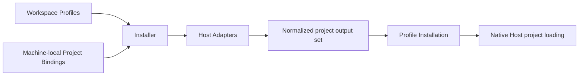

# Agent Profile Kit Architecture

This document describes the implemented project-bound architecture for Profile Context and portable Skills on Codex CLI and Claude Code. The former per-session overlay implementation is removed.

## Purpose

Agent Profile Kit is an open-source, user-agnostic tool and format for defining portable Profiles once and installing them into local projects for supported Agent Hosts. Hosts load the generated material through their native project discovery; Agent Profile Kit does not participate when a Host session runs.

The tool repository owns the CLI, schemas, Installer, Adapters, and product documentation. Each user owns an independent Workspace containing reusable cross-project material. Each project repository remains authoritative for its own facts and configuration.

## Application Boundary

```text
~/.agents/agent-profile-kit/
├── workspace/                 # Fixed-default user-owned Workspace (when selected)
│   ├── workspace.yaml         # Required Workspace Manifest (schema marker)
│   ├── profiles/              # Optional category; missing means empty
│   ├── context/
│   ├── skills/
│   ├── agents/
│   ├── hooks/
│   └── tools/
├── config.yaml                # Machine-local explicit Workspace selection + Project Bindings
└── state/                     # Disposable installation index and staging state
```

Each machine has exactly one selected Workspace. The fixed default is `~/.agents/agent-profile-kit/workspace/`, and current Local Configuration explicitly records either that path or one existing absolute or home-relative custom path. Symlinks are resolved once at ingestion to a canonical directory while the authored spelling remains available for diagnostics. Profiles and artifacts may be version-controlled independently of the engine. `config.yaml` is machine-local because checkout paths, Workspace placement, and installed Hosts vary by machine. Credential values belong in Host authentication, environment references, or operating-system secret storage and are invalid in both the Workspace and installation records.

```yaml
schema_version: 2
workspace: ~/projects/agent-profile-workspace   # required; absolute or ~/… only
bindings: []
```

A valid Workspace requires only a supported `workspace.yaml`. Artifact directories and bootstrap docs (`README.md`, `AGENTS.md`, `.gitignore`) are initialization scaffolding for discoverability, not permanent format requirements: missing categories ingest as empty, and present artifacts remain fully validated. That layout rule is enforced by CLI **0.16.1+**; it does not change `workspace.yaml` `schema_version` (still `1`). Machines on 0.15.x or older still require the full scaffold — restore the six category directories and bootstrap files before rolling a CLI back, or keep every shared Workspace fully scaffolded in mixed-version environments (see the Workspace guide). A version-1 Local Configuration without `workspace` is legacy migration input only. `init` records the conventional default when upgrading it; desired-state and binding-recording commands fail closed with `agent-profile-kit init` guidance until migration completes. Current Local Configuration schema version is `2` and its `workspace` field is required. Older engines are not claimed to understand the version-2 file. Before migrating a legacy file, operators must retain a pre-migration backup; rollback without that backup is unsupported. The immediately previous 0.20.x CLI can use the restored version-1 configuration; follow the [Workspace migration guide](guides/workspace.md#legacy-local-configuration-migration-and-version-compatibility) for the restore procedure.

Desired-state commands (`validate`, `preview`, `apply`, and `status`) resolve the Workspace through the shared Local Configuration ingestion boundary (`ingestApplication`) before reading artifacts or Project Bindings. `init` separately parses Local Configuration and reuses the configured-path resolver (`resolveWorkspaceRoot`) so a custom path is validated without creating or repairing it. `uninstall` intentionally operates from installation ownership state only and does not resolve a Workspace, keeping recovery independent of valid source or configuration. Invalid configured targets (relative paths, wildcards, missing paths, files, dangling symlinks, empty directories, or directories without a valid `workspace.yaml`) fail before any Workspace, configuration, project, Host, or state write.

`agent-profile-kit init` idempotently creates a fully scaffolded empty Workspace at the fixed default and a minimal `config.yaml` containing `schema_version: 2`, the explicit conventional `workspace` path, and `bindings: []` when Local Configuration is absent. When configuration already selects a custom Workspace path, `init` validates that existing target and does not create, move, copy, adopt, or repair it. When upgrading a legacy version-1 configuration, `init` validates the effective Workspace and atomically publishes only the migrated Local Configuration, preserving its Project Bindings and authored content. It never overwrites an existing Workspace or current local configuration, and it does not recreate optional scaffolding inside an already valid Workspace (including a Manifest-only tree). Humans and agents edit Workspace artifacts directly. Project Bindings may be hand-edited in Local Configuration or recorded with the authoring-only `bind` command; Local Configuration remains the sole canonical home either way.

## Runtime Boundary

Agent Profile Kit participates only during explicit reconciliation:



There is no Agent Profile Kit launcher, session router, global Skill projection, background watcher, or runtime daemon. A project has at most one bound Profile at a time. All sessions launched in that project receive the same installed Profile, and simultaneous session-specific Profiles in one project are intentionally unsupported.

## Project Bindings

A Project Binding associates exactly one explicit project root with one Profile and a set of Agent Hosts:

```yaml
schema_version: 2
workspace: ~/projects/agent-profile-workspace
bindings:
  - project: ~/projects/tools/agent-profile-kit
    profile: engineering
    hosts:
      - codex
      - claude
  - project: ~/projects/business/customer-portal
    profile: engineering
    hosts:
      - codex
```

Every `project` is an explicit existing directory that the user declares to be the project root. Paths must be absolute or begin with `~/`; other relative paths are invalid. Home-relative paths and symbolic links are normalized once at ingestion to a canonical absolute directory, which is used for identity and installation state while the authored spelling remains available for display. Wildcards, directory scans, and implicit parent-root detection are unsupported. A canonical project root may appear in exactly one binding; duplicates are invalid regardless of whether their Profile and Hosts agree.

Git is optional. When a project is not a Git working tree, native Codex discovery can guarantee the installed project Context only when Codex starts in the exact bound root; starting it in a descendant is unsupported because Codex has no repository boundary to search toward. Claude project rules load from the project root independently of Git. The project workflow documents the Codex launch-from-root constraint.

For a Git binding, the Installer asks Git for the repository's authoritative existing worktree list and maps the binding's repository-relative directory into each checkout. It does not scan neighboring folders or discover unrelated repositories. Every mapped directory must already exist as a real directory, and roots reached through more than one binding are deduplicated. A later-created worktree remains missing until the next explicit `apply`.

Commands separate binding authoring from global reconciliation:

- `bind` appends one validated Project Binding to Local Configuration only. It serializes other `bind` processes with a sidecar lock, rechecks the exact source snapshot, and publishes with an atomic replacement. It does not preview, apply, or touch Host, Workspace, project, or installation state.
- `unbind` removes one Project Binding from Local Configuration only. Existing paths match by canonical identity; a missing path may match only its exact authored spelling. It uses the same lock, snapshot recheck, and atomic publication boundary as `bind`, and never removes generated output.
- `validate` checks the Workspace and Project Bindings.
- `preview` shows additions, updates, removals, unchanged installations, and blocking conflicts without writing.
- `apply` reconciles every binding.
- `status` reports current, stale, drifted, and missing installations.
- `uninstall` safely removes all owned Profile Installations without deleting the Workspace or bindings.

`unbind` changes desired Project Binding state and directs the user to global
`preview`/`apply` for output removal. `uninstall` is the separate output-cleanup
lifecycle: it removes only ownership-proven generated output and preserves
bindings. There are no per-project filters on reconciliation commands. `bind`
and `unbind` are recording-only; hand-editing Local Configuration remains valid,
and `bind` does not replace or remove an existing binding.

## Canonical Model

Profiles are explicit flat selections of Context, Skills, Agents, Hooks, and Tools for a kind of work. The current slice accepts Context and portable Skills for Codex and Claude; Agents, Hooks, and Tools fail at ingestion before writes when selected for a Host that cannot preserve them. A Profile must select at least one supported artifact overall; no single category is mandatory, so Context-only, Skills-only, and combined Profiles are valid. A Skills-only Profile installs only selected Skill packages and Installer lifecycle metadata—Adapters emit no Context envelope, Codex SessionStart hooks, or Claude unscoped Context rule, and Host capability preflight is derived from the selected categories. Skills-only remains under Workspace `schema_version: 1` but is a **CLI 0.17.0+** acceptance change: older binaries still reject empty Context selections at ingestion, so convert or uninstall Skills-only Profiles with a 0.17+ CLI before rolling a machine back (see the Workspace guide). Profiles contain no inheritance, wildcards, Host settings, project paths, or artifact versions. A binding always selects the current Workspace form of its Profile; `apply` updates every project bound to that Profile. A project that needs different material binds to a different Profile rather than pinning an older revision.

Context Modules contain reusable declarative facts, preferences, and standing rules. The engine deterministically composes selected Context inside one canonical envelope that identifies the Profile and explicitly states that repository-owned project instructions take precedence on conflict. Adapters deliver the same semantic envelope without attempting to normalize physical load order across Hosts. Agent Profile Kit does not detect contradictions in prose.

Skills conform to the portable subset of the Agent Skills standard. Standard Skill package members are projected with source bytes and modes preserved, except for Host-native translation of optional model-invocation policy (`metadata.agent-profile-kit.model-invocation`, default `allowed`). Agents, Hooks, and Tools retain their portable canonical definitions and are accepted for a Host only when its Adapter can preserve their required semantics.

Dependencies are explicit typed references. The Installer resolves them transitively, installs each Artifact ID once, and records every inclusion reason. A duplicate Host-visible artifact identity outside the owned output is a conflict rather than an implicit precedence rule.

During desired-state preflight, each selected Adapter performs read-only overlap detection against its personal/global Skill roots for selected Skill Artifact IDs only. Codex inspects `~/.agents/skills` and `~/.codex/skills` using frontmatter `name` as Host-visible identity; Claude inspects `~/.claude/skills` using the package directory name when `SKILL.md` is present. Missing roots are empty; uninspectable roots fail closed. Matching global delivery—including identical bytes and symlinks into the Workspace—blocks `preview`/`apply` with an actionable message and never mutates global Host material. `status` reports the installation as blocked when such overlap appears after a successful apply.

## Adapter Boundary

Each supported Agent Host has one Adapter that owns its native paths, formats, discovery behavior, version detection, and Capability Contract. An Adapter is a pure planner: it returns exact proposed files, bytes, modes, and semantic requirements but does not write to the filesystem.

The Installer normalizes all Adapter plans for one project into a single output set:

- Identical path, type, mode, and bytes are coalesced and record every consuming Host.
- Any disagreement for the same path fails during `preview`.
- Paths that escape the project root are invalid.
- Tracked paths and occupied unowned paths are conflicts.
- The Installer owns complete generated files and artifact directories, never selected fields inside another owner's file.

This makes shared Host paths emerge from exact output equality rather than a maintained compatibility table or Adapter-to-Adapter coordination.

An Adapter rejects a Profile when the detected Host version or project surface cannot preserve every selected artifact. Nothing is silently omitted or weakened. Host authentication, project trust, and approval flows remain native concerns; Agent Profile Kit never writes global trust or authentication state.

## Initial Adapter Mappings

The project-bound release supports Codex CLI and Claude Code on macOS for Profile Context and portable Skills. Agents, portable Hooks, Tools, and additional Agent Hosts remain explicit future slices. Both Adapters emit the same canonical Context envelope (Profile identity, module source boundaries, and repository-instructions precedence); Host-specific delivery is Adapter-local.

### Codex

The Codex Adapter generates the composed Context snapshot under an owned `.agent-profile-kit/codex/` path and an owned project `.codex/hooks.json`. A native `SessionStart` Hook prints the snapshot for `startup`, `resume`, `clear`, and `compact`, which Codex adds as extra developer Context. In Git projects the command resolves the snapshot from the Git worktree root plus the binding-relative path; in non-Git projects it uses a project-relative path under the launch-from-root contract. The command embeds no absolute project path and needs no generated helper script. Repository `AGENTS.md` files and global instructions remain live and untouched. The generated Hook requires Codex's native review and trust. Lifecycle Hooks must be explicitly enabled in global or project Codex configuration; Context is unsupported when they are disabled, unset, or the required whole-file path is occupied.

Resolved standard Skill packages are planned as owned artifact directories under the project-relative `.agents/skills/<Artifact ID>/` tree that Codex discovers natively. Portable package members keep source file bytes and modes; Agent Profile Kit-only sidecars such as `agent-profile-kit.yaml` are omitted. Optional model-invocation policy is Adapter-owned Host translation: trusted `metadata.agent-profile-kit.model-invocation` (`allowed` default, or `disabled`) becomes Codex `agents/openai.yaml` with `policy.allow_implicit_invocation: false` when disabled, without rewriting Workspace source. When any selected Skill is disabled, Codex capability preflight requires CLI `0.99.0+` (first stable tag with `policy.allow_implicit_invocation`; openai/codex#11244) in addition to SessionStart hooks and records Capability Contract `native-project-sessionstart-skills-invocation-v1`. Unselected Workspace Skills are not installed. There is no global Skill library, process filter, or launcher. Preflight also fails closed when a selected Skill’s frontmatter identity is already discoverable under `~/.agents/skills` or `~/.codex/skills`.

### Claude Code

The Claude Adapter generates the same canonical Context envelope as an unscoped owned project rule at `.claude/rules/agent-profile-kit.md`. The rule has no `paths` frontmatter so Claude loads it project-wide and re-injects it after compaction alongside existing project, local, user, and managed instructions. Resolved standard Skill packages are planned as owned artifact directories under the project-relative `.claude/skills/<Artifact ID>/` tree that Claude discovers natively. Portable package members keep source file bytes and modes; Agent Profile Kit-only sidecars such as `agent-profile-kit.yaml` are omitted. When trusted model-invocation policy is `disabled`, the Claude Adapter projects `disable-model-invocation: true` into generated `SKILL.md`, records Capability Contract `native-project-unscoped-rules-skills-invocation-v1`, and reuses the existing `2.0.64+` CLI floor (which honors that field). Workspace source stays unchanged. Unselected Workspace Skills are not installed. Preflight fails closed when a selected Skill’s directory identity already exists under personal `~/.claude/skills`, because personal scope overrides project scope. `CLAUDE.md`, other rules, settings, trust, authentication, plugins, and sessions remain Host-owned and are never modified. Capability preflight requires a Claude Code CLI on `PATH` at or above the Adapter minimum that first shipped recursive `.claude/rules/` support (`2.0.64`, which already includes native project Skill discovery) and rejects non-directory `.claude` or `.claude/rules` surfaces before writes. After a successful check the Installation Manifest records the Claude capability-contract version covering unscoped rules and native Skill discovery, not raw CLI marketing numbers. When both Codex and Claude are bound, each Adapter plans its own Host-native Skill tree; exact shared output coalesces only when path, type, mode, and bytes agree.

## Reconciliation and Ownership

`preview` builds and validates the entire desired output for every bound project before `apply` writes anything. A predictable conflict in any project blocks all writes. Once preflight succeeds, each project is updated transactionally. An unexpected filesystem failure may leave later projects unapplied; the command reports the exact completed and pending set, and rerunning `apply` converges safely.

One machine-local Installation Manifest records each project's selected Profile, Hosts, Adapter and engine versions, resolved artifacts, deterministic source hash, and every owned output's project-relative path, entry type, mode, and hash. Owned artifact directories also record their complete member tree so missing, drifted, and unexpected members can be proven without Host sessions. A minimal `.agent-profile-kit/installation.json` marker travels with the project and links it to that record through an opaque installation ID. The Installer creates the marker during the first successful project transaction; it is lifecycle metadata rather than Adapter output. Together the marker and record prove ownership across a project-folder move without becoming a second source of desired state. Bindings remain authoritative.

When a configured project moves, its marker lets reconciliation update the recorded path. If a copied project creates the same installation ID at two existing roots, reconciliation fails instead of silently adopting either copy. A missing or modified marker is drift. At the Manifest's recorded path, `apply` may restore a missing marker only when the record and every remaining output hash independently prove the installation; at a different path, the missing identity cannot prove a move and installation fails.

When a binding, Host, project, or artifact disappears, `apply` removes the no-longer-desired output only after its Manifest, Installation Marker, and current hashes prove ownership. Modified generated files are reported as drift and are never overwritten or removed silently.

Generated project paths are owned whole files. A symlink, occupied parent, or
occupied unowned path blocks installation; shared repository and Host
configuration are never edited. In Git repositories, the Installer keeps its
generated files untracked through one marked set of exact, root-anchored entries
in Git's repository-local exclude file. Reconciliation replaces or removes only
that marked section after proving its exact entries against Installation
Manifests, preserving every unrelated byte and never changing a shared
`.gitignore`. Exclusion changes advance with each successfully committed project
transaction, so a partial apply reflects only actual Installation Manifest
state. The Installer treats the common directory reported by Git as the
repository-local metadata authority only after proving every path component is
a real directory; it then stages exclusion bytes read-only and publishes them
after the corresponding machine-local Manifest state is durable.

## Freshness and Versioning

Profiles and artifacts are not independently versioned. Deterministic hashes distinguish current installations from source changes and output drift. The engine, schemas, and Adapters share the package's semantic version; structured configuration and Manifest formats carry schema versions.

## Ownership Scope

The Workspace owns reusable personal cross-project material as the single canonical source, including artifacts selected by Profiles and unselected universal artifacts. Profile selection controls Agent Profile Kit–managed project delivery only; it does not relocate canonical ownership into Host configuration. Project repositories own domain facts and shared project configuration. Native Agent Host configuration owns global settings and capabilities, including any user-managed global Skill delivery outside Project Bindings and Installation Manifests. Local Configuration owns Project Bindings and other non-secret machine bindings. Generated Profile Installations and installation records are disposable and must never be edited as canonical source. Agent Profile Kit v1 does not install, synchronize, or remove material in personal/global Host roots.
