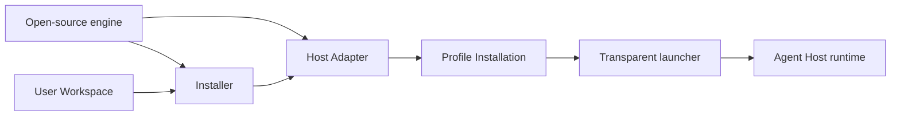
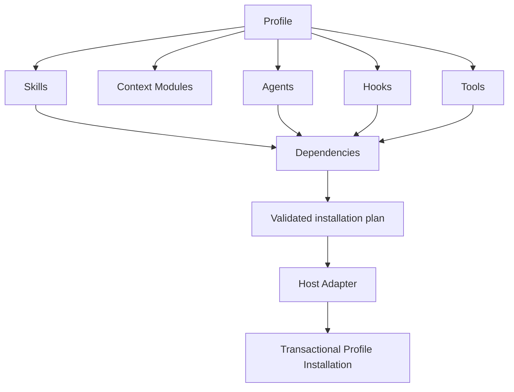

# Agent Profile Kit Architecture

This document describes the agreed target architecture. The repository is still being migrated toward this model.

## Purpose

Agent Profile Kit is an open-source, user-agnostic tool and format. Each user owns an independent Workspace containing personal, cross-project Skills and related material composed into Profiles. Codex, Claude Code, Gemini, OpenCode, Pi, and other supported Agent Hosts consume derived Profile Installations while project-specific knowledge remains owned by each project repository.

The tool repository owns the CLI, schemas, Installer, Adapters, and product documentation. It does not own a user's canonical artifacts. The current repository's personal and reusable artifact collection is legacy migration input that must be classified before public release.

## Workspace Boundary

The default application root separates canonical user content from generated state:

```text
~/.agents/agent-profile-kit/
├── workspace/                 # User-owned canonical source
│   ├── workspace.yaml
│   ├── README.md
│   ├── AGENTS.md
│   ├── profiles/
│   ├── context/
│   ├── skills/
│   ├── agents/
│   ├── hooks/
│   └── tools/
└── installations/             # Agent Profile Kit-owned disposable output
    └── <profile-id>/<host-id>/
```

The initial release supports exactly one Workspace per user at the fixed path above. It has no public Workspace path override, registry, or project-specific Workspace selection. The Workspace may be a private or public Git repository version-controlled independently of Agent Profile Kit, but Git is not required. Repository visibility and content review are the user's responsibility; Agent Profile Kit provides only a brief reminder to review personal material before publishing and does not scan, classify, or block Workspace publication. Credential values remain invalid regardless of repository visibility. Backups include `workspace/`; `installations/` can always be regenerated.

The fixed Workspace path may be a symbolic link to a valid Workspace stored elsewhere. The fixed path remains the only public lookup location; the link does not introduce a Workspace registry or alternate selection mechanism.

### Initialization and guidance

`agent-profile-kit init` creates an empty, structurally valid Workspace. `workspace.yaml` marks the root and schema version; empty artifact directories provide the authoring locations. The command does not install personal material, starter Skills, or a sample Profile.

The schema version identifies the complete Workspace Manifest shape. Unknown fields are rejected so misspellings cannot silently enter the trusted model; adding a manifest field requires a new schema version and the explicit migration path described below.

The generated `README.md` and `AGENTS.md` are short bootstrap pointers rather than copies of maintained product instructions. Human guidance comes from `agent-profile-kit guide`; agent-oriented authoring guidance comes from `agent-profile-kit guide --agent`. The agent guide combines current schemas and examples with an actionable workflow: inspect the Workspace, elicit the user's session needs one decision at a time, create the smallest useful Profile and artifacts, preserve artifact boundaries, exclude credentials and project facts, validate, produce a Host-specific plan, and obtain direction before an unrequested installation. Both guides are bundled documentation resources printed by the CLI rather than duplicated hardcoded text. The `init` result prints both the manual next step and a ready-to-use prompt telling an agent to run the agent guide. A globally installed management Skill is therefore optional future convenience rather than a bootstrap dependency.

Humans and agents edit Workspace files directly. The initial CLI does not provide a parallel CRUD interface for creating or editing every artifact type; it owns initialization, current guidance, validation, planning, installation lifecycle, status, and launching. A management Skill is out of scope for the initial release because it would duplicate CLI guidance and require Host-specific bootstrapping and version synchronization.

Initialization is non-destructive and idempotent. A missing Workspace is created; an existing valid Workspace is reported unchanged; a non-empty directory without a valid Workspace Manifest is rejected. `init` never overwrites Workspace files or Git state and initially has no force mode. Workspace schema changes use a separate explicit migration operation.

Initialization creates a Git-friendly `.gitignore` and prints optional commands for initializing a repository, but it does not run Git, create commits, configure remotes, or require Git.

## Source and Runtime Boundary

Agent Profile Kit participates when a Profile Installation is created or updated and when its transparent launcher starts an Agent Host. Agent Hosts use generated Profile Installations at runtime and never load canonical files from the canonical Workspace.



Runtime interaction, including Hook event data and Tool calls, stays between the Agent Host and locally installed components.

## Canonical Model



### Skills

Skills are the canonical reusable workflow unit and conform to the portable subset of the Agent Skills open standard. Standard Skill content is installed unchanged. Agent Profile Kit-only orchestration metadata may live in an optional `agent-profile-kit.yaml` sidecar.

Commands are host-specific ways to activate Skills and never own workflow instructions.

### Agents

Agents are reusable delegated workers authored as portable `AGENT.md` packages. They own host-independent behavioral and safety requirements. Adapters render them into native Agent formats and must enforce required boundaries or reject installation.

### Hooks

Hooks define portable lifecycle intent and a required observational, advisory, enforcing, or transforming effect. Adapters generate native Hook configuration and any minimal glue needed by the target Host. Runtime events interact only with the installed Hook handler.

### Context

Context Modules contain small, reusable sets of always-loaded facts, preferences, and standing rules. Profiles compose Context Modules; procedural workflows belong in Skills, and large on-demand knowledge belongs in Skill resources or Tools.

Agent Profile Kit composes Context deterministically and preserves module boundaries or source labels, but does not define a semantic precedence system or resolve contradictions. The active Agent Host and user handle contextual conflicts.

### Tools

Agent Tools are model-callable and use focused MCP servers as their default portable interface. Internal Utilities remain ordinary executables or libraries. Single-Skill scripts remain Skill Resources, and host-provided functionality is an External Capability rather than an Agent Profile Kit Tool.

### Profiles

Profiles are explicit, flat selections of canonical Context, Skills, Agents, Hooks, and Tools for a kind of work, such as coding, research, or personal assistance. Profiles have no inheritance, select stable Artifact IDs, and may coexist across simultaneous Agent Host sessions. They do not abstract general Host settings such as model selection, reasoning level, theme, sandbox mode, telemetry, or session behavior.

A Profile is explicitly selected and applied as a per-process overlay when launching an Agent Host. The initial design has no default Profile. The Host's ordinary global and project configuration remains in effect and remains user-owned. Agent Profile Kit guarantees that one session does not receive material selected only by another Profile; it does not suppress unrelated global or project customization.

Canonical Profiles are flat YAML files under the Workspace's `profiles/`. Each declares its stable Profile ID and explicit Context, Skill, Agent, Hook, and Tool selections. Profiles have no inheritance, inclusions, wildcards, or Host-specific settings.

Generated Profile Installations are persistent mutable directories under `~/.agents/agent-profile-kit/installations/<profile-id>/<host-id>/`. Each directory is self-contained, so the same canonical artifact may appear in multiple generated installations without creating another maintained source. An explicit `install` creates one Host/Profile pair, while `update` regenerates the already-installed set recorded by manifests. Launching never installs, updates, or checks the canonical source for staleness.

Source-dependent operations such as `install`, `update`, and source comparison always read the fixed canonical Workspace and can run from any directory. `run`, installation-only status checks, and `uninstall` can also run anywhere. Only the Host launched by `run` interprets the current working directory as its project. Uninstall removes a whole Profile Installation only after its Manifest confirms the expected Profile and Host identity.

The launcher preserves the working directory, passes native Host arguments through unchanged, adds only the selected Profile's per-process integration, and then replaces itself with the native Host process. It does not modify shell configuration, intercept native Host commands, manage sessions, or suppress global and project customization. Each Adapter owns both generation and final native command construction for its Host.

## Installation Pipeline


Each `~/.agents/agent-profile-kit/installations/<profile-id>/<host-id>/` installation root has one Installation Manifest covering that one Profile's generated output. The entire root is Agent Profile Kit-owned and disposable. The Manifest records the Profile ID, Host and Adapter version, Agent Profile Kit version, selected artifacts and resolved dependencies, schema version, a deterministic hash of every resolved Workspace input, and a hash of the complete generated installation. If the Workspace uses Git, its commit SHA and dirty state are recorded as informational provenance only; the input hash determines freshness. Updates stage and validate a complete replacement instead of tracking ownership file by file.

`validate` checks the Workspace independently of a Host. `plan --profile <id> --host <id>` is read-only: it resolves dependencies, checks the Adapter Capability Contract, compares desired output with the existing installation, and reports additions, changes, removals, destinations, and failures. `install` consumes the same plan before applying it so preview and write behavior cannot diverge.

Updates are explicit. Status reporting identifies current, stale, and drifted Profile Installations.

## Versioning

Agent Profile Kit uses one semantic version for its Installer, schemas, and Adapters. Installation Manifests also record the deterministic Workspace input hash, optional Git provenance, and structured-file schema version. Canonical artifacts are not independently versioned until they need to be published or consumed outside the Workspace.

## Host Boundary

Each supported Agent Host has one Adapter that owns all knowledge of that Host: paths, discovery, schemas, event mappings, native bundle formats, configuration, feature detection, and compatibility behavior.

Adapters are one-way. They generate and launch from Workspace source but do not scan or import existing global Host configuration. Initial Workspace creation is clean, and migration of this repository's existing artifact collection is a one-time project task rather than a permanent reverse-translation feature.

Plugins and extensions are generated Host Bundles. They are disposable outputs rather than canonical sources.

The initial implementation supports the Codex CLI and Claude Code CLI on macOS only. Codex desktop, Codex IDE extensions, non-CLI Claude surfaces, Linux, and Windows remain unsupported until their own Capability Contracts and platform behavior are implemented. Each Adapter must prove, with two concurrent sessions using distinct Profile markers, that each process receives only its selected Profile while retaining ordinary global and project configuration. The test must also verify that shared Host configuration is unchanged and native arguments, authentication, and session handling still work. A Host that cannot pass is unsupported rather than silently receiving weaker isolation. Other Agent Hosts remain intended targets but are unsupported until they have an Adapter and Capability Contract.

An update guarantees the new installation for sessions launched afterward. Already-running sessions follow native Host reload behavior; Agent Profile Kit does not restart sessions, pin old files, or guarantee live reload timing.

### Initial Adapter mappings

The Claude Code Adapter generates one native plugin per Profile containing Skills, rendered Agents, Hooks, MCP servers, and executable utilities. It generates composed Context separately and launches Claude Code with the Profile plugin directory and appended system-prompt file. This uses session-scoped native inputs and leaves Claude's global and project configuration active.

The Codex Adapter generates Skills, Agent configuration layers, Hook handlers, Tool configuration, and composed Context within the Profile Installation. It passes their native representations through per-process `-c` configuration overrides, including `developer_instructions`, `skills.config`, `agents`, `hooks`, and `mcp_servers`. It does not register a marketplace plugin, create a file under `~/.codex`, or change `CODEX_HOME`. This mapping remains conditional on passing the Adapter acceptance test for the supported Codex version.

## Configuration and Credentials

Canonical artifacts own portable parameter definitions and defaults. Untracked Local Configuration owns machine-specific, non-secret bindings. Host authentication, environment references, or operating-system secret storage own credential values.

## Ownership Scope

The user-owned Workspace contains personal, user-scoped, cross-project material. Each project repository remains the canonical home for its domain facts, conventions, and project-specific configuration. Agent Hosts combine project instructions with the selected Profile at runtime. The open-source repository contains only the engine, schemas, documentation, and minimal non-personal examples or test fixtures.

## Target Repository Map

```text
agent-profile-kit/
├── cli/
├── adapters/
├── installer/
├── schemas/
├── docs/
│   ├── adr/
│   ├── runbooks/
│   └── archive/
├── CONTEXT.md
├── AGENTS.md
└── README.md
```

User Workspaces, personal artifacts, generated Host Bundles, staging output, Local Configuration, Installation Manifests, and Profile Installations are not source material in the open-source repository.
