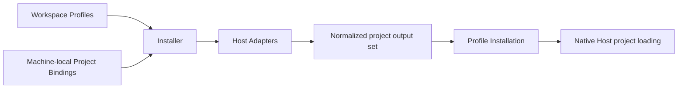

# Agent Profile Kit Architecture

This document describes the implemented project-bound architecture for Profile Context and portable Skills on Codex CLI, Claude Code, Grok, and Pi. The former per-session overlay implementation is removed.

## Purpose

Agent Profile Kit is an open-source, user-agnostic tool and format for defining portable Profiles once and installing them into local projects for supported Agent Hosts. Hosts load the generated material through their native project discovery; Agent Profile Kit does not participate when a Host session runs.

The tool repository owns the CLI, schemas, Installer, Adapters, and product documentation. Each user owns an independent Workspace containing reusable cross-project material. Each project repository remains authoritative for its own facts and configuration.

## Application Boundary

```text
~/.agents/agent-profile-kit/
├── workspace/                 # Fixed-default user-owned Workspace (when selected)
│   ├── workspace.yaml         # Required Workspace Manifest (schema marker)
│   ├── profiles/              # Optional category; missing means empty
│   ├── context/
│   ├── skills/
│   ├── agents/
│   ├── hooks/
│   └── tools/
├── config.yaml                # Machine-local explicit Workspace selection + Project Bindings
└── state/                     # Disposable installation index and staging state
```

Each machine has exactly one selected Workspace. The fixed default is `~/.agents/agent-profile-kit/workspace/`, and current Local Configuration explicitly records either that path or one absolute or home-relative custom path. `init <workspace>` may scaffold a missing or empty non-symlink custom destination, or adopt an existing valid Workspace, before recording the authored selection. Symlinks are resolved once at ingestion to a canonical directory while the authored spelling remains available for diagnostics. Profiles and artifacts may be version-controlled independently of the engine. `config.yaml` is machine-local because checkout paths, Workspace placement, and installed Hosts vary by machine. Credential values belong in Host authentication, environment references, or operating-system secret storage and are invalid in both the Workspace and installation records.

```yaml
schema_version: 2
workspace: ~/projects/agent-profile-workspace   # required; absolute or ~/… only
bindings: []
```

A valid Workspace requires only a supported `workspace.yaml`. Artifact directories and bootstrap docs (`README.md`, `AGENTS.md`, `.gitignore`) are initialization scaffolding for discoverability, not permanent format requirements: missing categories ingest as empty, and present artifacts remain fully validated. That layout rule is enforced by CLI **0.16.1+**; it does not change `workspace.yaml` `schema_version` (still `1`). Machines on 0.15.x or older still require the full scaffold — restore the six category directories and bootstrap files before rolling a CLI back, or keep every shared Workspace fully scaffolded in mixed-version environments (see the Workspace guide).

New Workspaces also scaffold a neutral example Profile and Context Module as one bindable pair. They are optional after initialization and must be removed together so the Profile does not select a missing Context Module.

A version-1 Local Configuration without `workspace` is legacy migration input only. `init` records the conventional default when upgrading it; desired-state and binding-recording commands fail closed with `apkit init` guidance until migration completes. Current Local Configuration schema version is `2` and its `workspace` field is required. Older engines are not claimed to understand the version-2 file. Before migrating a legacy file, operators must retain a pre-migration backup; rollback without that backup is unsupported. The immediately previous 0.20.x CLI can use the restored version-1 configuration; follow the [Workspace migration guide](guides/workspace.md#legacy-local-configuration-migration-and-version-compatibility) for the restore procedure.

Desired-state commands (`validate`, `preview`, `apply`, and `status`) resolve the Workspace through the shared Local Configuration ingestion boundary (`ingestApplication`) before reading artifacts or Project Bindings. `init` separately parses Local Configuration and validates an explicit request against the configured canonical selection before preparing source or publishing configuration. With no argument, a configured custom path is validated without creating or repairing it. `uninstall` intentionally operates from installation ownership state only and does not resolve a Workspace, keeping recovery independent of valid source or configuration. Invalid configured or explicit targets (relative paths, wildcards, files, dangling symlinks, empty symlink targets, and non-Workspace directories) fail before any Workspace or configuration publication.

`apkit init` idempotently creates a fully scaffolded Workspace at the fixed default or at one explicit requested destination and a minimal `config.yaml` containing `schema_version: 2`, the authored `workspace` path, and `bindings: []` when Local Configuration is absent. `installer/authoring-examples.ts` is the canonical home for the neutral Profile, Context Module, and Skill examples consumed by initialization, focused guides, and command examples; initialization writes only the Profile and Context Module. A valid existing explicit destination is adopted without changing source. When configuration already selects a Workspace, zero-argument `init` validates it; an explicit request must resolve to the same canonical directory, while a different selection fails before source or configuration writes. When upgrading a legacy version-1 configuration, `init` validates the effective Workspace and atomically publishes only the migrated Local Configuration, preserving its Project Bindings and authored content. It never overwrites an existing Workspace or current local configuration, and it does not recreate optional scaffolding inside an already valid Workspace (including a Manifest-only tree). Humans and agents edit Workspace artifacts directly. Project Bindings may be hand-edited in Local Configuration or recorded with the authoring-only `bind` command; Local Configuration remains the sole canonical home either way.

## Runtime Boundary

Agent Profile Kit participates only during explicit reconciliation:



There is no Agent Profile Kit launcher, session router, global Skill projection, background watcher, or runtime daemon. A project has at most one bound Profile at a time. All sessions launched in that project receive the same installed Profile, and simultaneous session-specific Profiles in one project are intentionally unsupported.

## Project Bindings

A Project Binding associates exactly one explicit project root with one Profile and a set of Agent Hosts:

```yaml
schema_version: 2
workspace: ~/projects/agent-profile-workspace
bindings:
  - project: ~/projects/tools/agent-profile-kit
    profile: engineering
    hosts:
      - codex
      - claude
      - grok
      - pi
  - project: ~/projects/business/customer-portal
    profile: engineering
    hosts:
      - codex
```

Every `project` is an explicit existing directory that the user declares to be the project root. Paths must be absolute or begin with `~/`; other relative paths are invalid. Home-relative paths and symbolic links are normalized once at ingestion to a canonical absolute directory, which is used for identity and installation state while the authored spelling remains available for display. Wildcards, directory scans, and implicit parent-root detection are unsupported. A canonical project root may appear in exactly one binding; duplicates are invalid regardless of whether their Profile and Hosts agree.

Host selections are a set normalized at Local Configuration and `bind` ingestion: authored order and repeated entries collapse to the deterministic `SUPPORTED_HOSTS` order (`claude`, `codex`, `grok`, `pi`).

Git is optional. When a project is not a Git working tree, native Codex discovery can guarantee the installed project Context only when Codex starts in the exact bound root; starting it in a descendant is unsupported because Codex has no repository boundary to search toward. Claude project rules and Grok project rules load from the project root independently of Git. The project workflow documents the Codex launch-from-root constraint.

For a Git binding, the Installer reconciles only the explicit canonical project root. It uses Git only to inspect that root's repository boundary, tracked paths, and repository-local exclusions; it does not enumerate, classify, deduplicate, or report worktree topology. A primary checkout and linked worktree are indistinguishable at the Project Binding boundary. A Host session launched from the bound root may operate on files elsewhere, while any other root that must support direct Host launches requires its own explicit Project Binding.

Every bound root, Git or non-Git, uses the same removal semantics. The ordinary order is `unbind`, `apply`, then delete the directory. If the directory is deleted first, the binding remains desired state until `unbind` matches its exact authored path. That explicit removal confirms intent; the next `apply` retires the absent Profile Installation without project filesystem deletion and removes any separately surviving repository-local exclusion entries whose ownership was recorded for that installation. Restoring the project later requires a new `bind` and `apply`. Worktrees receive no special deletion or recovery mechanism.

The former development-only automatic worktree expansion has no compatibility or state-migration path. It was never released; development installations created by that behavior are reset and reapplied from canonical source.

Commands separate binding authoring from global reconciliation:

- `bind` appends one validated Project Binding to Local Configuration only. It serializes other `bind` processes with a sidecar lock, rechecks the exact source snapshot, and publishes with an atomic replacement. It does not preview, apply, or touch Host, Workspace, project, or installation state.
- `unbind` removes one Project Binding from Local Configuration only. Existing paths match by canonical identity; a missing path may match only its exact authored spelling. It uses the same lock, snapshot recheck, and atomic publication boundary as `bind`, and never removes generated output.
- `validate` checks the Workspace and Project Bindings.
- `preview` lists planned generated-file additions, updates, repairs, removals, and attention states, plus blocking conflicts without writing; `--verbose` exposes complete per-output diagnostics and definitions for present non-current Profile Installation states; `--json` emits the versioned machine payload described below.
- `apply` reconciles every binding and, after its commits, performs a fresh
  reconciliation to report the verified resulting state. It separately emits
  an `Applied` section containing the pre-apply generated-output and Repository
  Exclusion work that was committed, distinct from the verified `Pending` work;
  a verification failure still reports applied work and exits `1`. `--json`
  includes both the resulting-state snapshot and an `applied` receipt snapshot.
- `status` reports current, intended teardown, stale source, repairable missing output, drifted output, missing output, malformed ownership, and blocked installations. Intended teardown is Installer-recorded provenance, not inferred from absent files. A fully current concise status states that fact once; non-current state definitions are available through `--verbose`. `--json` uses the same machine payload and exit-code matrix as `preview` and `apply`.
- `uninstall` safely removes all owned Profile Installations without deleting the Workspace or bindings, and reports each affected project, removed path, and cleaned Git exclusion entry. (`uninstall` is outside the lifecycle machine surface and keeps its own exit semantics.) Temporary Profile Installations and their Repository Exclusion contributions are preserved.
- `install-temp <profile> <project> --host <host>` installs one Profile temporarily into one explicit Project for one Host (Codex in the first slice). It reuses Adapter planning, ownership preflight, transactional publication, and contributor-aware Repository Exclusion records, writes durable temporary installation state under the ordinary state root (Installation State schema v5 `temporary_installations`), and never creates a Project Binding or runs global reconciliation. `--json` emits a versioned temporary-installation receipt.
- `remove-temp <temporary-installation-id>` removes only that Temporary Profile Installation's owned outputs and exclusion contribution. A successful removal leaves a terminal removed identity so repeated calls remain idempotent.

`preview`, `apply`, and `status` share one machine-surface exit matrix and one
JSON serializer in `cli/presentation.ts`: exit `0` means no tool error and no
blockers (JSON `outcome` may still be `attention` for pending work), exit `1`
is a tool error (`outcome: "error"` under `--json` when flags were accepted),
and exit `2` means blockers are present. The JSON contract is versioned
(`schemaVersion: 1`) and is not stability-guaranteed before 1.0. Temporary
installation receipts use the same exit matrix (`0` / `1` / `2`) with their own
versioned JSON schema.

`unbind` changes desired Project Binding state and directs the user to global
`preview`/`apply` only when an Installation Manifest shows that generated output
still requires reconciliation. `uninstall` is the separate output-cleanup
lifecycle: it removes only ownership-proven generated output and preserves
bindings. There are no per-project filters on reconciliation commands. `bind`
and `unbind` are recording-only; hand-editing Local Configuration remains valid,
and `bind` does not replace or remove an existing binding.

## Canonical Model

Profiles are explicit flat selections of Context, Skills, Agents, Hooks, and Tools for a kind of work. The current slice accepts Context and portable Skills for Codex, Claude, Grok, and Pi; Agents, Hooks, and Tools fail at ingestion before writes when selected for a Host that cannot preserve them. Trusted disabled model-invocation policy is projected into Pi-native frontmatter while explicit Artifact ID activation remains available. A Profile must select at least one supported artifact overall; no single category is mandatory, so Context-only, Skills-only, and combined Profiles are valid. A Skills-only Profile installs only selected Skill packages and Installer lifecycle metadata—Adapters emit no Context envelope, Codex SessionStart hooks, Claude unscoped Context rule, or Grok unscoped Context rule, and Host capability preflight is derived from the selected categories. Skills-only remains under Workspace `schema_version: 1` but is a **CLI 0.17.0+** acceptance change: older binaries still reject empty Context selections at ingestion, so convert or uninstall Skills-only Profiles with a 0.17+ CLI before rolling a machine back (see the Workspace guide). Profiles contain no inheritance, wildcards, Host settings, project paths, or artifact versions. A binding always selects the current Workspace form of its Profile; `apply` updates every project bound to that Profile. A project that needs different material binds to a different Profile rather than pinning an older revision.

Context Modules contain reusable declarative facts, preferences, and standing rules. The engine deterministically composes selected Context inside one canonical envelope that identifies the Profile and explicitly states that repository-owned project instructions take precedence on conflict. Adapters deliver the same semantic envelope without attempting to normalize physical load order across Hosts. Agent Profile Kit does not detect contradictions in prose.

Skills conform to the portable subset of the Agent Skills standard. Standard Skill package members are projected with source bytes and modes preserved, except for Host-native translation of optional model-invocation policy (`metadata.agent-profile-kit.model-invocation`, default `allowed`). Agents, Hooks, and Tools retain their portable canonical definitions and are accepted for a Host only when its Adapter can preserve their required semantics.

Dependencies are explicit typed references. The Installer resolves them transitively, installs each Artifact ID once, and records every inclusion reason.

Each supported Agent Host owns Skill discovery, precedence, deduplication,
collision diagnostics, and resolution across project, personal, package,
plugin, extension, and compatibility sources. Adapters do not reconstruct those
resolvers or inventories. Same-identity material outside an exact planned
output destination is Host Resolution and does not block lifecycle commands.
Where an Adapter can detect a concrete disable without reconstructing Host
Resolution, it emits an actionable warning: Codex checks SessionStart hooks and
Grok checks `[skills].disabled` and `[skills].ignore`. Malformed or unreadable
configuration that an Adapter reads for planned output also warns.
Capability failures, unrepresentable portable semantics, and exact Output
Ownership Conflicts remain blockers.

## Adapter Boundary

Each supported Agent Host has one Adapter that owns its native paths, formats, discovery behavior, version detection, Capability Contract, and Host Setup Steps. An Adapter is a pure planner: it returns exact proposed files, bytes, modes, semantic requirements, and typed post-apply setup requirements but does not write to the filesystem.

Host Setup Steps use the shared kinds `approval-required`, `trust-required`, `launch-constraint`, and `shared-path`. Host identity has one Adapter-plan-level home; the Installer attaches that identity when it carries each Adapter-authored step into the ReconciliationReport. A step may identify its path semantically as the bound project, leaving the one canonical path presenter to choose its user-facing spelling. Presentation orders and renders the report steps without deriving Host knowledge. `apply` renders every step, `preview` renders only approval and launch constraints, and `status` deduplicates them into one callout per Host. Blocked `preview` and `apply` runs suppress post-apply steps for work that did not happen, and a no-op `apply` does not claim next-launch activation.

The Installer normalizes all Adapter plans for one project into a single output set:

- Identical path, type, mode, and bytes are coalesced and record every consuming Host.
- Any disagreement for the same path fails during `preview`.
- Paths that escape the project root are invalid.
- Tracked paths and occupied unowned paths are conflicts.
- The Installer owns complete generated files and artifact directories, never selected fields inside another owner's file.

This makes shared Host paths emerge from exact output equality rather than a maintained compatibility table or Adapter-to-Adapter coordination.

An Adapter rejects a Profile when the detected Host version or project surface cannot preserve every selected artifact. Nothing is silently omitted or weakened. Host authentication, project trust, and approval flows remain native concerns; Agent Profile Kit never writes global trust or authentication state.

## Initial Adapter Mappings

The project-bound release supports Codex CLI, Claude Code, Grok, and Pi on macOS for Profile Context and portable Skills, including Pi-native projection of disabled model invocation. Agents, portable Hooks, Tools, and additional Agent Hosts remain explicit future slices. Every Context Adapter emits the same canonical Context envelope (Profile identity, module source boundaries, and repository-instructions precedence); Host-specific delivery is Adapter-local.

### Codex

The Codex Adapter generates the composed Context snapshot under an owned `.agent-profile-kit/codex/` path and an owned project `.codex/hooks.json`. A native `SessionStart` Hook prints the snapshot for `startup`, `clear`, and `compact`, which Codex adds as extra developer Context. Resume is intentionally omitted: Codex reconstructs the conversation from the rollout, which already contains any prior injection, so re-running the Hook on resume would duplicate Context. Profile Context is therefore stable for the life of a conversation; a changed Installation takes effect on the next `startup`, `clear`, or `compact`, not merely because the session is reopened. The generated command handler sets `additionalContextLimit: 0`, the Codex contract for passing complete `additionalContext` directly to the model instead of spilling a head-and-tail preview (`0` means unlimited direct delivery, not "none"; see <https://github.com/openai/codex/releases/tag/rust-v0.145.0>). Context capability preflight requires Codex CLI `0.145.0+` (the first stable release containing that handler field) on `PATH` and rejects older, missing, or unreadable versions before writes. Skills-only Codex plans do not probe this floor. `status`, `validate`, and `uninstall` pass `checkHostCapability: false`, so a post-apply Codex downgrade below `0.145.0` is not re-proved there; if Context stops loading after a downgrade, upgrade back to a supported CLI or re-apply after restoring one. In Git projects the command resolves the snapshot from the Git worktree root plus the binding-relative path; in non-Git projects it uses a project-relative path under the launch-from-root contract. The command embeds no absolute project path and needs no generated helper script. Repository `AGENTS.md` files and global instructions remain live and untouched. When Context is selected, the Adapter emits hook-approval and project-trust steps; it also emits the exact-root launch constraint for a non-Git binding. A Skills-only Codex plan emits none of those Context-specific steps and records a Skills-only Capability Contract. Lifecycle Hooks are enabled by default; the Adapter warns when the effective global or project Codex configuration explicitly disables them (`[features].hooks = false`, with project configuration taking precedence, or the deprecated `codex_hooks` alias), or when relevant configuration is malformed or unreadable. These diagnostics do not block installation. The global file is `CODEX_HOME/config.toml` when `CODEX_HOME` is set, otherwise `~/.codex/config.toml`. Context remains unsupported when the required whole-file path is occupied.

Resolved standard Skill packages are planned as owned artifact directories under the project-relative `.agents/skills/<Artifact ID>/` tree that Codex discovers natively. Portable package members keep source file bytes and modes; Agent Profile Kit-only sidecars such as `agent-profile-kit.yaml` are omitted. Optional model-invocation policy is Adapter-owned Host translation: trusted `metadata.agent-profile-kit.model-invocation` (`allowed` default, or `disabled`) becomes Codex `agents/openai.yaml` with `policy.allow_implicit_invocation: false` when disabled, without rewriting Workspace source. When any selected Skill is disabled, Codex capability preflight also requires CLI `0.99.0+` (first stable tag with `policy.allow_implicit_invocation`; openai/codex#11244). Context-bearing installations record `native-project-sessionstart-complete-context-v1` or `native-project-sessionstart-complete-context-skills-invocation-v1`; Skills-only installations record `native-project-skills-v1` or `native-project-skills-invocation-v1`. Unselected Workspace Skills are not installed. There is no global Skill library, process filter, or launcher. Codex resolves same-identity Skills from other Host-native sources.

### Claude Code

The Claude Adapter generates the same canonical Context envelope as an unscoped owned project rule at `.claude/rules/agent-profile-kit.md`. The rule has no `paths` frontmatter so Claude loads it project-wide and re-injects it after compaction alongside existing project, local, user, and managed instructions. Resolved standard Skill packages are planned as owned artifact directories under the project-relative `.claude/skills/<Artifact ID>/` tree that Claude discovers natively. Portable package members keep source file bytes and modes; Agent Profile Kit-only sidecars such as `agent-profile-kit.yaml` are omitted. When trusted model-invocation policy is `disabled`, the Claude Adapter projects `disable-model-invocation: true` into generated `SKILL.md`, records Capability Contract `native-project-unscoped-rules-skills-invocation-v1`, and reuses the existing `2.0.64+` CLI floor (which honors that field). Workspace source stays unchanged. Unselected Workspace Skills are not installed. Claude resolves same-identity Skills from personal and other Host-native sources. `CLAUDE.md`, other rules, settings, trust, authentication, plugins, and sessions remain Host-owned and are never modified. Capability preflight requires a Claude Code CLI on `PATH` at or above the Adapter minimum that first shipped recursive `.claude/rules/` support (`2.0.64`, which already includes native project Skill discovery) and rejects non-directory `.claude` or `.claude/rules` surfaces before writes. After a successful check the Installation Manifest records the Claude capability-contract version covering unscoped rules and native Skill discovery, not raw CLI marketing numbers. When both Codex and Claude are bound, each Adapter plans its own Host-native Skill tree; exact shared output coalesces only when path, type, mode, and bytes agree.

Claude plans no Host Setup Steps. After a changed installation with no
actionable Host Setup Steps, `apply` explicitly reports that no further Host
setup is required before the next-launch guidance.

### Grok

The Grok Adapter generates the same canonical Context envelope as an unscoped owned Markdown rule. Grok always scans project `.grok/rules/*.md`; the Adapter’s default owned path is `.grok/rules/agent-profile-kit.md`. When Claude is co-selected on the same Project Binding and Grok reports Claude rules compatibility enabled (`grok inspect --json` `externalCompat` cell `claude`/`rules`), the Grok Adapter plans the exact Claude rule path and envelope bytes so Installer normalization coalesces one effective copy that both Hosts load. That exact coalescing case emits a `shared-path` Host Setup Step naming Claude's rule path; Grok-only, compatibility-disabled, and Context-free plans emit no such step. Grok-only bindings and combined bindings with Claude rules disabled continue to use `.grok/rules/`. Resolved standard Skill packages are planned as owned artifact directories under the project-relative `.grok/skills/<Artifact ID>/` tree that Grok discovers natively. Portable package members keep source file bytes and modes; Agent Profile Kit-only sidecars such as `agent-profile-kit.yaml` are omitted. When trusted model-invocation policy is `disabled`, the Grok Adapter projects `disable-model-invocation: true` into generated `SKILL.md`, records Capability Contract `native-project-unscoped-rules-skills-invocation-v1`, and reuses the existing `0.2.0+` CLI floor (which honors that field). Workspace source stays unchanged. Unselected Workspace Skills are not installed. Capability preflight requires a Grok CLI on `PATH` at or above `0.2.0` and rejects non-directory `.grok`, `.grok/rules` (when Context is selected), or `.grok/skills` (when Skills are selected) surfaces before writes. Context planning additionally requires successful `grok inspect --json` so Claude-rule compatibility can be determined; Skills-only planning does not inspect Grok's effective inventory. Grok resolves same-identity material across personal, plugin, compatibility, extra-path, and project sources. A concrete `[skills].disabled` or `[skills].ignore` setting that covers planned output warns without blocking, as does malformed or unreadable relevant configuration. Repository-owned instructions (`AGENTS.md` and peers), other rules, trust, authentication, and Host configuration remain untouched. After a successful check the Installation Manifest records Capability Contract `native-project-unscoped-rules-v1` for Context-only Profiles, `native-project-unscoped-rules-skills-v1` when Skills are selected, or the invocation contract when any selected Skill requires disabled model invocation.

### Pi

The Pi Adapter requires Pi CLI `0.82.1+` and plans the canonical Context
envelope as the complete owned project file `.pi/APPEND_SYSTEM.md`. It plans
each resolved Skill once under `.pi/skills/<Artifact ID>/`, preserving standard
package bytes and modes while omitting the `agent-profile-kit.yaml` sidecar.
Allowed-invocation Skills retain their source `SKILL.md`; disabled-invocation
Skills receive top-level Pi-native `disable-model-invocation: true`, which Pi
honors by hiding them from the model's system prompt while preserving the
canonical `name` used by explicit `/skill:<Artifact ID>` activation. Pi's
official Skills documentation defines this enforcement behavior, introduced in
Pi 0.50.0 and included in the supported 0.82.1+ floor:
<https://pi.dev/docs/latest/skills> and <https://pi.dev/news/releases/0.50.0>.
Before writes it proves `.pi` and the selected output surfaces. Pi owns
discovery and resolution across personal, ancestor, project, package, extension,
and other configured Skill sources; the Adapter does not scan or approximate
that inventory. For Skill-bearing Profiles, it reads the canonical global and
project Pi settings only to warn when relevant configuration is malformed or
unreadable. Extensions, packages, and additional Skill sources
coexist through Pi Host Resolution and do not block installation. Context-only
Profiles skip this settings inspection. Pi's native project trust,
authentication, settings, prompt files, and per-session overrides remain
Host-owned and are never changed; explicit runtime `--skill` and `--no-skills`
overrides remain outside the Installation guarantee. Every non-empty Pi plan
therefore emits a `trust-required` Host Setup Step; an empty plan emits none.
Context-only installations
record `native-project-append-system-v1`; allowed Skills-only and combined
installations record `native-project-skills-v1` and
`native-project-append-system-skills-v1`; installations with at least one
disabled-invocation Skill record `native-project-skills-invocation-v1` or
`native-project-append-system-skills-invocation-v1`, all under Adapter version
`pi-project-v1`.

Installation State with Pi Skill-capable `host_versions` requires Agent Profile
Kit 0.32.0+; unbind Pi or re-apply/uninstall with 0.32.0+ before rolling back
below 0.32.0. Context-only Pi state remains readable with 0.31.0+, and any
Installation State that records the `pi` Host requires 0.31.0+ before rolling
back to 0.30.3 or older.
Invocation-capable Pi `host_versions` are first recorded by Agent Profile Kit
0.34.0; unbind Pi or re-apply/uninstall with 0.34.0+ before rolling back an
invocation-capable installation below 0.34.0.

## Reconciliation and Ownership

`preview` builds and validates the entire desired output for every bound project before `apply` writes anything. A predictable conflict in any project blocks all writes. Once preflight succeeds, each project is updated transactionally. An unexpected filesystem failure may leave later projects unapplied; the command reports the exact completed and pending set, and rerunning `apply` converges safely.

The apply presentation keeps the pre-commit receipt distinct from the
post-commit snapshot in both concise and verbose output: `Applied` labels the
receipt and `Pending` labels remaining work from the verified snapshot. The
resulting snapshot is authoritative for whether Profile Installations are
current; the receipt is the audit of work that was performed.

One machine-local Installation Manifest records each project's selected Profile, Hosts, Adapter and engine versions, resolved artifacts, deterministic source hash, and every owned output's project-relative path, entry type, mode, and hash. Owned artifact directories also record their complete member tree so missing, drifted, and unexpected members can be proven without Host sessions. For Git projects, machine-local installation state additionally contains one Repository Exclusion Record per canonical exclusion-file path. Each record maps contributing Installation IDs (ordinary and active temporary) to their exact entries, and its deterministic union is the expected marked section; this permits safe shared ownership and cleanup even after a contributing project root disappears. A minimal `.agent-profile-kit/installation.json` marker travels with the project and links it to its Installation Manifest through an opaque installation ID. The Installer creates the marker during the first successful project transaction; it is lifecycle metadata rather than Adapter output. Together the marker and records prove ownership across a project-folder move without becoming a second source of desired state. Bindings remain authoritative for ordinary Profile Installations. Temporary Profile Installations use receipt-owned lifetime under Installation State `temporary_installations` (see ADR-0015); they contribute to exclusion records while remaining outside ordinary `installations[]`. On successful ordinary `uninstall`, Installation State replaces each removed ordinary Manifest with one intended-teardown record carrying its Installation ID, canonical project, Profile, and Hosts, while preserving temporary installations and their exclusion contributions. Binding identity prevents a different binding at the same project from inheriting stale teardown provenance. A successful reinstall replaces the ordinary record with the new Manifest, so installed and intentionally uninstalled cannot be represented simultaneously. Current Installation State schema version is **5**. Schemas 2–4 remain read-only migration inputs at the state boundary; the next successful lifecycle write that publishes state writes schema 5. A 0.49.x or earlier engine cannot read schema 5—retain a pre-upgrade `state/manifest.yaml` backup before the first 0.50.0+ state write if downgrade may be required.

The recorded `engine_version` is installation provenance, not desired state. A newer CLI leaves an otherwise-current Profile Installation untouched; the provenance advances only when another real reconciliation change publishes a new Manifest.

New Manifests also retain the installation-time `git_project` classification. It distinguishes a deleted Git installation whose Repository Exclusion Record is missing from a non-Git installation without rediscovering ancestors or Git worktree topology; Repository Exclusion Records remain the sole source for exclusion targets and entries.

When a configured project moves, its marker lets reconciliation update the recorded path. If a copied project creates the same installation ID at two existing roots, reconciliation fails instead of silently adopting either copy. A missing or modified marker is drift. At the Manifest's recorded path, `apply` may restore a missing marker only when the record and every remaining output hash independently prove the installation; at a different path, the missing identity cannot prove a move and installation fails.

When a binding, Host, project, or artifact disappears, `apply` removes the no-longer-desired output only after its Manifest, Installation Marker, and current hashes prove ownership. For a currently bound installation with a matching Marker, `apply` recreates wholly absent recorded outputs from current Workspace source when every surviving output remains ownership-proven and ordinary path-conflict checks pass. Modified generated files, mode drift, unexpected directory members, and occupied destinations are reported as drift and are never overwritten or removed silently.

Generated project paths are owned whole files. A symlink, occupied parent, or
occupied unowned path blocks installation; shared repository and Host
configuration are never edited. In Git repositories, the Installer keeps its
generated files untracked through one marked set of exact, root-anchored entries
in Git's repository-local exclude file. Reconciliation replaces or removes only
that marked section after proving its exact target and entries against
the single canonical ownership record for that exclusion file, preserving every
unrelated byte and never changing a shared `.gitignore`. Multiple installations
contribute to one deterministic entry union; removing one contribution cannot
remove entries still required by another. Exclusion changes advance with each successfully committed project
transaction, so a partial apply reflects only actual Installation Manifest
state. The Installer treats the common directory reported by Git as the
repository-local metadata authority only after proving every path component is
a real directory; it then stages exclusion bytes read-only and publishes them
after the corresponding machine-local Manifest state is durable.

## Freshness and Versioning

Profiles and artifacts are not independently versioned. Deterministic hashes distinguish current installations from source changes and output drift. The engine, schemas, and Adapters share the package's semantic version; structured configuration and Manifest formats carry schema versions.

## Ownership Scope

The Workspace owns reusable personal cross-project material as the single canonical source, including artifacts selected by Profiles and unselected universal artifacts. Profile selection controls Agent Profile Kit–managed project delivery only; it does not relocate canonical ownership into Host configuration. Project repositories own domain facts and shared project configuration. Native Agent Host configuration owns global settings and capabilities, including any user-managed global Skill delivery outside Project Bindings and Installation Manifests. Local Configuration owns Project Bindings and other non-secret machine bindings. Generated Profile Installations and installation records are disposable and must never be edited as canonical source. Agent Profile Kit v1 does not install, synchronize, or remove material in personal/global Host roots.
